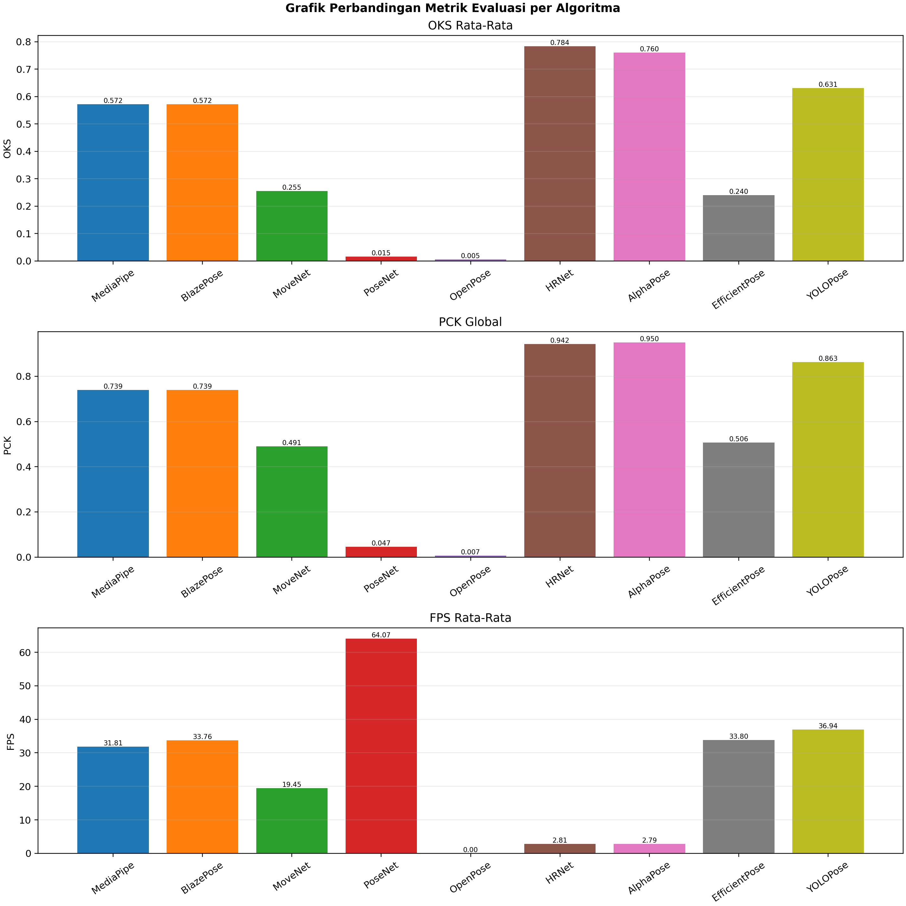
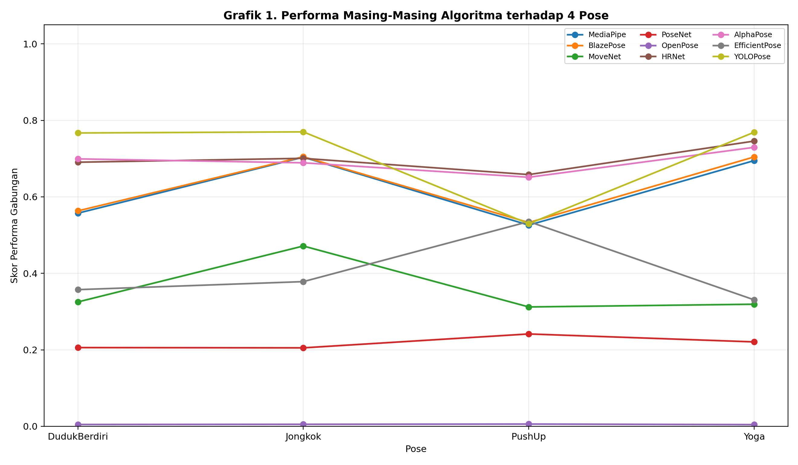
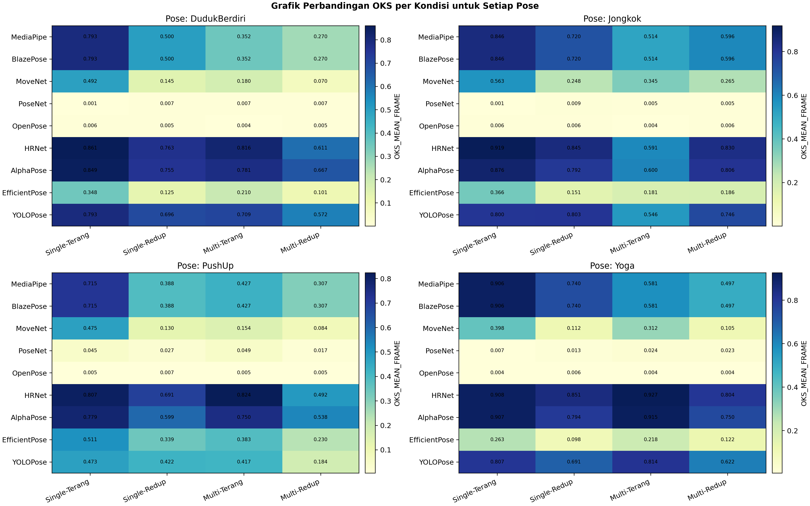
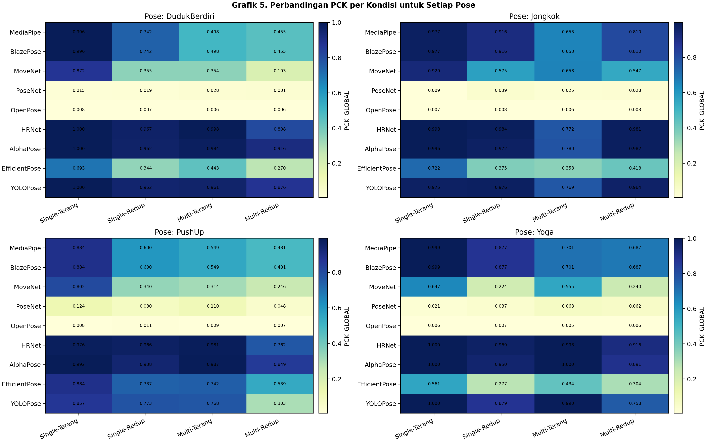
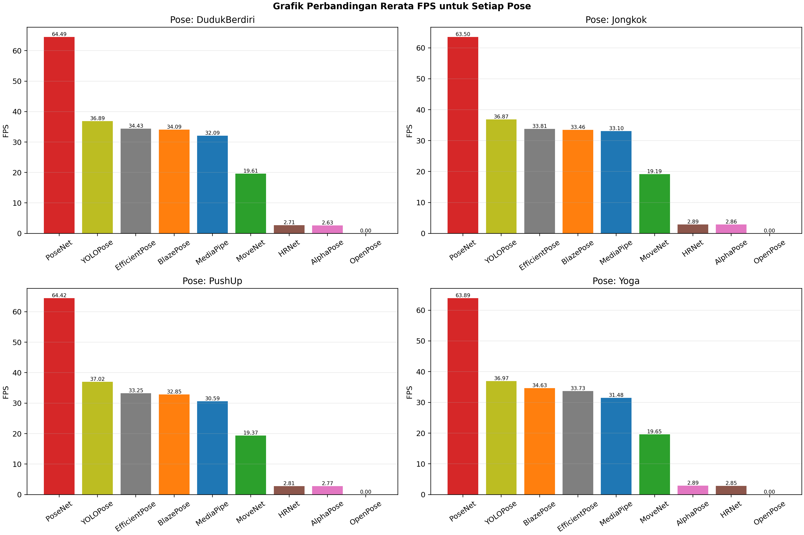
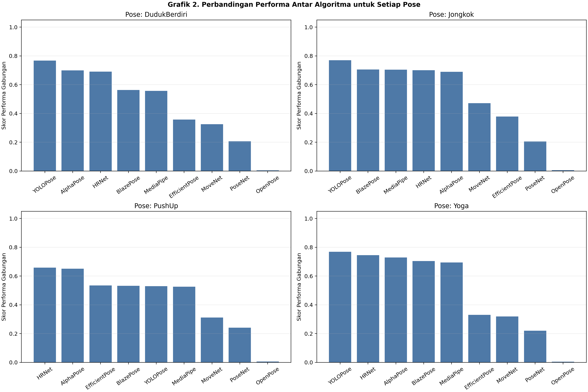

ANALISIS PERBANDINGAN ALGORITMA DETEKSI POSE UNTUK ESTIMASI GERAK MANUSIA

Skripsi

diajukan sebagai salah satu syarat untuk memperoleh gelar
Sarjana Pendidikan

oleh
Deswal Waskito
5302422031

PENDIDIKAN TEKNIK INFORMATIKA DAN KOMPUTER
FAKULTAS TEKNIK
UNIVERSITAS NEGERI SEMARANG
SEMARANG, 2026

DAFTAR ISI

DAFTAR ISI	i
DAFTAR GAMBAR	v
DAFTAR TABEL	vi
DAFTAR LAMPIRAN	vii
BAB I PENDAHULUAN	1
1.1	Latar Belakang	1
1.2	Rumusan Masalah	3
1.3	Tujuan Penelitian	4
1.4	Manfaat Penelitian	4
1.4.1	Manfaat Teoretis	4
1.4.2	Manfaat Praktis	4
1.5	Kebaruan Penelitian	5
1.6	Batasan Masalah	5
BAB II KAJIAN PUSTAKA	6
2.1	Tinjauan Pustaka	6
2.2	Landasan Teoretik	7
2.2.1	Konsep dan Prinsip Dasar Human Pose Estimation	7
2.2.1.1	Pre-processing Citra	10
2.2.1.2	CNN Feature Extraction	10
2.2.1.3	Prediksi Keypoint	10
2.2.1.4	Skeleton Construction	10
2.2.1.5	Analisis Pose Lanjutan	11
2.2.2	Peran dan Penerapan HPE dalam Berbagai Bidang	11
2.2.2.1	Penerapan HPE dalam Bidang Olahraga	11
2.2.2.2	Penerapan HPE dalam Bidang Kesehatan dan Rehabilitasi	12
2.2.2.3	Penerapan HPE dalam Aktivitas Sehari-hari	12
2.2.3	Arsitektur dan Pendekatan dalam HPE	13
2.2.3.1	Single-Person dan Multi-Person Pose Estimation	13
2.2.3.2	Pendekatan Top-Down dan Bottom-Up	14
2.2.3.3	Representasi Keypoint Heatmap-Based dan Regression-Based	15
2.2.3.4	Arsitektur Berbasis Single-Stage dan Multi-Stage	16
2.2.3.5	Tantangan Arsitektural dalam Kondisi Dunia Nyata	16
2.2.4	Algoritma HPE	17
2.2.4.1	PoseNet	17
2.2.4.2	MoveNet	17
2.2.4.3	OpenPose	18
2.2.4.4	MediaPipe Pose	18
2.2.4.5	HRNet	19
2.2.4.6	YOLO-Pose	19
2.2.4.7	AlphaPose	19
2.2.4.8	BlazePose	20
2.2.4.9	DeepLabCut	20
2.2.4.10	EfficientPose	20
2.2.5	Dataset COCO dan Standar Anotasi Keypoint	21
2.2.5.1	Dataset COCO	21
2.2.5.2	Struktur Anotasi Keypoint pada Dataset COCO	22
2.2.5.3	Relevansi Dataset COCO dalam Penelitian	23
2.2.6	Metode Evaluasi HPE	23
2.2.6.1	Percentage of Correct Keypoints (PCK)	24
2.2.6.2	Object Keypoint Similarity (OKS)	26
2.2.6.3	Prinsip Konseptual Evaluasi Single-Person dan Multi-Person	27
2.2.7	Average Precision (AP) sebagai Rujukan Teoretis	27
BAB III METODE PENELITIAN	29
3.1	Pendekatan, Jenis, dan Prosedur Penelitian	29
3.2	Lokasi dan Waktu Penelitian	31
3.3	Subjek Penelitian / Sampel dan Populasi	31
3.4	Variabel dan Definisi Operasional	33
3.4.1	Variabel Independen	33
3.4.2	Variabel Dependen	34
3.4.3	Definisi Operasional Variabel	34
3.4.4	Hubungan Antar Variabel	35
3.5	Data dan Sumber Data	36
3.6	Teknik Pengumpulan Data	37
3.6.1	Penentuan Pose Penelitian	37
3.6.2	Pengambilan Data Video	38
3.6.3	Anotasi Ground Truth	39
3.6.4	Dokumentasi Data Visual	40
3.7	Teknik Keabsahan Data	40
3.7.1	Validitas Data Visual	40
3.7.2	Keabsahan Anotasi Ground Truth	41
3.7.3	Keandalan Prosedur Evaluasi	41
3.7.4	Pengendalian Bias Penelitian	41
3.8	Teknik Analisis Data	42
3.8.1	Pencocokan Prediksi dan Ground Truth (Matching)	42
3.8.2	Perhitungan Object Keypoint Similarity (OKS)	42
3.8.3	Perhitungan Percentage of Correct Keypoints (PCK)	43
3.8.4	Agregasi Hasil Evaluasi	43
3.8.5	Analisis Efisiensi Komputasi	44
3.8.6	Analisis Statistik dan Penafsiran Hasil	44
BAB IV HASIL DAN PEMBAHASAN	45
4.1	Deskripsi Umum Data Hasil Pengujian	45
4.2	Hasil Evaluasi Kinerja Algoritma Berdasarkan OKS	49
4.2.1	Nilai OKS Rata-Rata Per Algoritma	49
4.2.2	OKS Berdasarkan Variasi Jumlah Orang	49
4.2.3	OKS Berdasarkan Variasi Pencahayaan (Terang vs Redup)	49
4.2.4	Pembahasan Pola Kinerja OKS	49
4.3	Hasil Evaluasi Berdasarkan PCK	49
4.3.1	PCK@t per Algoritma	49
4.3.2	PCK Berdasarkan Pose	49
4.3.3	Pembahasan PCK	49
4.4	Analisis Efisiensi Komputasi (FPS)	49
4.4.1	FPS Rata-Rata Per Algoritma	49
4.4.2	Trade-off Akurasi vs Kecepatan	49
4.5	Analisis Pola Kegagalan Algoritma	49
4.5.1	Kegagalan pada Kondisi Multi-Person (Oklusi)	49
4.5.2	Kegagalan pada Pencahayaan Rendah	49
4.5.3	Kegagalan per Paradigma Arsitektur	49
4.6	Perbandingan Menyeluruh Antar Algoritma	49
4.6.1	Rekapitulasi OKS-PCK-FPS	49
4.6.2	Interpretasi Hasil (Mengaitkan dengan Teori)	49
4.7	Implikasi Temuan Penelitian	49
DAFTAR PUSTAKA	50
LAMPIRAN - LAMPIRAN	58

DAFTAR GAMBAR

Gambar 2. 1. Pendekatan Top-down	14
Gambar 2. 2. Pendekatan Bottom-up	15
Gambar 2. 3. Pendekatan Heatmap-based	15
Gambar 2. 4. Pendekatan Regression-based	16
Gambar 3. 1. (a) Proses Anotasi Ground Truth CVAT (b) COCO 17 Keypoint	39
Gambar 4. 1. Grafik Perbandingan Metrik Evaluasi per Algoritma	49
Gambar 4. 2. Grafik Performa Masing-Masing Algoritma terhadap 4 Pose	49
Gambar 4. 3. Grafik Perbandingan OKS per Kondisi untuk Setiap Pose	49
Gambar 4. 4. Grafik Perbandingan PCK per Kondisi untuk Setiap Pose	49
Gambar 4. 5. Grafik Perbandingan Rerata FPS untuk Setiap Pose	49
Gambar 4. 6. Grafik Perbandingan Performa Antar Algoritma untuk Setiap Pose	49

DAFTAR TABEL

Tabel 3. 1. Definisi Operasional Variabel Penelitian	34
Tabel 3. 2. Daftar Pose yang Dianalisis	37

DAFTAR LAMPIRAN

Lampiran 1. Biodata Penulis	54
Lampiran 2. Surat Keterangan Pembimbing	55
Lampiran 3. Instrumen Penelitian	56

BAB I 
PENDAHULUAN

1.1 Latar Belakang
      Estimasi Gerak Manusia atau Human Pose Estimation (HPE) didefinisikan sebagai tugas fundamental dalam computer vision yang bertujuan untuk mengidentifikasi dan mengklasifikasikan titik-titik sendi kunci (keypoints) pada tubuh manusia dari data visual seperti gambar atau video (Stenum et al., 2021). Proses ini secara efektif menerjemahkan gerakan tubuh yang kompleks menjadi data koordinat yang presisi, baik dalam format 2D (x, y) maupun 3D (x, y, z), yang memungkinkan mesin untuk memahami postur, gerakan, dan dinamika tubuh manusia secara mendalam (Dubey & Dixit, 2023). Dengan mengidentifikasi titik-titik kunci seperti siku, lutut, dan pergelangan tangan, HPE memberdayakan sistem artificial intelligence (AI) untuk memahami dan mengukur postur dan gerakan tubuh, hal ini membuka jalan bagi interaksi dan analisis yang lebih canggih (Cai et al., 2025). Seiring dengan kemajuan pesat dalam Deep Learning, teknologi ini telah berevolusi dari sistem berbasis penanda (marker-based) yang cenderung mahal, invasif, dan rumit menjadi sistem tanpa penanda (markerless) yang jauh lebih terjangkau, portabel, dan efisien (Avogaro et al., 2023).
      Signifikansi HPE dibuktikan oleh spektrum aplikasinya yang luas dan transformatif di berbagai sektor industri (Espitia-Mora et al., 2024). Dalam bidang kesehatan dan fisioterapi, teknologi ini digunakan untuk memantau postur pasien secara real-time, melacak kemajuan program rehabilitasi, memberikan umpan balik korektif untuk memastikan latihan dilakukan dengan benar, serta membantu dalam diagnosis gangguan muskuloskeletal atau neurologis (Garc a & Santos, 2025). Di dunia olahraga dan kebugaran, HPE berfungsi sebagai alat analisis untuk menyempurnakan teknik atlet, mencegah cedera dengan memantau postur selama sesi latihan, dan bertindak sebagai pelatih kebugaran AI dalam aplikasi seluler yang memberikan panduan secara langsung kepada pengguna (Grewe et al., 2022). Selain itu, dalam industri hiburan dan Augmented Reality (AR), HPE telah menyederhanakan proses motion capture untuk animasi dan video game, memungkinkan karakter digital meniru pose manusia secara real-time tanpa memerlukan penanda fisik yang mahal (Xian & Sahagun, 2023). Dalam ranah robotika dan Human Computer Interaction (HCI), HPE digunakan untuk mengajarkan robot meniru gerakan manusia untuk tugas-tugas manufaktur atau bedah, memungkinkan interaksi tanpa sentuhan (hands-free) melalui pengenalan gestur, dan meningkatkan aksesibilitas teknologi bagi penyandang disabilitas (Boby, 2022; de Oliveira Schultz Ascari et al., 2021). Di sektor keamanan dan pengawasan, teknologi ini krusial untuk mendeteksi perilaku tidak biasa, memantau aktivitas manusia untuk tujuan keamanan, dan mendukung sistem deteksi jatuh otomatis untuk populasi lansia (Kwan-Loo et al., 2022).
      Meskipun telah mencapai kemajuan yang pesat, model-model HPE modern seringkali menunjukkan penurunan kinerja yang signifikan ketika dihadapkan pada skenario dunia nyata yang kompleks. Kondisi-kondisi ini seringkali tidak terwakili dengan baik dalam dataset benchmark yang umumnya dikumpulkan dalam lingkungan yang terkontrol. Studi ini secara spesifik berfokus pada dua tantangan utama yang saling terkait dan sering muncul dalam aplikasi praktis, yaitu kepadatan orang (skenario multi-orang) dan kondisi pencahayaan yang buruk.   
      Ketika beberapa individu berada dalam satu adegan, oklusi baik yang disebabkan oleh bagian tubuh sendiri (self-occlusion), objek di lingkungan, maupun tumpang tindih antar-individu menjadi tantangan besar bagi akurasi model. Oklusi ini menimbulkan dua masalah utama. Pertama, feature confusion (kebingungan fitur), di mana model kesulitan membedakan fitur milik individu target dengan individu pengganggu yang memiliki kemiripan visual tinggi, terutama pada bagian tubuh yang tumpang tindih. Kedua, hilangnya informasi struktural tubuh yang lengkap. Oklusi menghalangi pandangan model terhadap keseluruhan kerangka sinematik, sehingga proses inferensi untuk memprediksi posisi sendi yang terhalang menjadi sangat sulit dan tidak andal (Bai et al., 2024).
      Adanya degradasi sinyal pada kondisi pencahayaan rendah juga menjadi tantangan yang dihadapi pada model HPE. Kondisi cahaya yang sangat rendah secara drastis merusak kualitas citra input, menyebabkan hilangnya detail visual yang kritis, visibilitas yang buruk secara umum, dan tingkat noise ISO yang tinggi. Model HPE yang sangat bergantung pada informasi tekstur dan detail frekuensi tinggi untuk melokalisasi sendi akan mengalami kesulitan besar, karena fitur-fitur esensial ini terdegradasi secara signifikan dalam kondisi tersebut. Pendekatan yang dilakukan seperti menerapkan teknik peningkatan citra (image enhancement) sebelum estimasi pose seringkali terbukti suboptimal. Hal ini karena teknik tersebut tidak dirancang secara spesifik untuk tugas downstream seperti deteksi keypoint dan berisiko mengorbankan informasi semantik yang justru penting untuk deteksi sendi yang akurat.
      Kedua tantangan ini tidak bersifat independen, sebaliknya, keduanya saling memperburuk dalam sebuah interaksi kausal. Kondisi pencahayaan rendah secara langsung mengurangi isyarat visual penting seperti tepi dan tekstur yang digunakan model untuk membedakan batas antar individu yang tumpang tindih. Hal ini secara signifikan memperparah masalah feature confusion. Lebih lanjut, ketika sebuah sendi mengalami oklusi, model seringkali mengandalkan konteks dari sendi-sendi lain yang terlihat untuk "menebak" posisinya. Namun, dalam kondisi cahaya rendah, konteks visual ini sendiri menjadi tidak dapat diandalkan, yang pada akhirnya menyebabkan kegagalan inferensi struktural. Oleh karena itu, skenario yang paling menantang dan paling representatif dari banyak aplikasi dunia nyata (misalnya, pengawasan malam hari, analisis kerumunan di dalam ruangan remang) adalah adegan multi-orang dalam kondisi pencahayaan rendah. Meskipun demikian, masih terdapat kekurangan analisis komparatif yang sistematis untuk mengevaluasi bagaimana berbagai arsitektur HPE merespons kombinasi tantangan ini. Penelitian ini bertujuan untuk mengisi kesenjangan pengetahuan tersebut.

1.2 Rumusan Masalah
1. Bagaimana perbandingan performa algoritma HPE pada eksperimen inti (PoseNet, MoveNet Thunder, OpenPose, MediaPipe Pose, HRNet, YOLOv8-Pose, AlphaPose, BlazePose, dan EfficientPose) ketika dihadapkan pada dataset video dengan variasi jumlah orang (single-person dan multi-person) serta kondisi pencahayaan (terang dan redup)?
2. Bagaimana pola kegagalan yang spesifik untuk setiap algoritma berdasarkan karakteristik arsitektural dalam skenario variasi jumlah orang dan kondisi pencahayaan?
1.3 Tujuan Penelitian
1. Mengevaluasi dan membandingkan performa sembilan algoritma HPE pada eksperimen inti menggunakan dataset video yang secara sistematis memvariasikan jumlah orang dan kondisi pencahayaan.
2. Menganalisis pola kegagalan spesifik dari setiap arsitektur dalam skenario variasi jumlah orang dan kondisi pencahayaan untuk memberikan wawasan tentang kekuatan dan kelemahan fundamental yang melekat pada desain algoritma.
3. Menyusun landasan empiris untuk perluasan penelitian ke rancangan penuh 10 algoritma dan 9 pose pada tahap lanjutan setelah sidang.

1.4 Manfaat Penelitian
      Penelitian ini terbagi menjadi dua, yaitu manfaat secara teoritis dan praktis.
1.4.1 Manfaat Teoretis
      Penelitian ini memberikan kontribusi ilmiah dengan memperkaya literatur computer vision mengenai batas-batas kemampuan model HPE saat ini dalam kondisi dunia nyata yang menantang. Hasilnya diharapkan dapat menyoroti area-area yang memerlukan penelitian lebih lanjut, seperti pengembangan arsitektur yang secara eksplisit dirancang untuk lebih tangguh terhadap oklusi berat dan degradasi sinyal akibat pencahayaan rendah, serta menjadi referensi akademik bagi peneliti di bidang estimasi gerak manusia.
1.4.2 Manfaat Praktis
a. Bagi Pengembang AI
Menjadi panduan teknis berbasis bukti untuk memilih algoritma HPE yang paling optimal sesuai dengan kebutuhan spesifik aplikasi, seperti sistem real-time pada perangkat edge atau analisis forensik presisi tinggi.
b. Bagi Industri
Menyediakan wawasan untuk meningkatkan keandalan produk dan layanan yang bergantung pada HPE, seperti sistem pengawasan cerdas di malam hari, aplikasi telehealth untuk rehabilitasi jarak jauh, dan sistem motion capture yang lebih efisien.
c. Bagi Peneliti Computer Vision
Menyediakan benchmark kuantitatif yang jelas mengenai batasan model-model HPE saat ini dalam kondisi ekstrem, sehingga dapat mengarahkan upaya penelitian di masa depan pada pengembangan arsitektur yang lebih tangguh.

1.5 Kebaruan Penelitian
      Penelitian ini menawarkan kebaruan yang membedakannya dari studi-studi sebelumnya dalam beberapa aspek kunci:
1. Kebaruan Konteks
Berbeda dengan (Roggio et al., 2024) yang hanya menyajikan narrative review mengenai model HPE tanpa pengujian empiris, penelitian ini melakukan eksperimen langsung pada dataset video dinamis dengan variasi jumlah orang dan kondisi pencahayaan. Studi sebelumnya seperti Bai et al. (2024) hanya menyoroti tantangan oklusi, sedangkan penelitian ini menggabungkan dua variabel stres yang umum di dunia nyata, yaitu kepadatan orang dan pencahayaan rendah.
2. Kebaruan Metode
Penelitian sebelumnya (Espitia-Mora et al., 2024; Stenum et al., 2021) umumnya menggunakan dataset statis dari benchmark seperti COCO, sedangkan penelitian ini menggunakan dataset video dinamis yang ditangkap secara khusus untuk memastikan pengujian yang lebih representatif terhadap aplikasi praktis.
3. Kebaruan Ilmu dan Teknologi	
Tidak seperti studi terdahulu oleh Jo & Kim (2022) yang hanya membandingkan sebagian kecil algoritma seperti MoveNet, PoseNet, dan OpenPose, penelitian ini dirancang untuk komparasi lintas paradigma arsitektural (top-down, bottom-up, berbasis regresi, heatmap, dan single-shot). Pada tahap sidang, implementasi empiris difokuskan pada sembilan algoritma siap-pakai, sedangkan DeepLabCut diposisikan sebagai perluasan pada tahap lanjutan karena membutuhkan pelatihan ulang domain-spesifik.

1.6 Batasan Masalah
      Penelitian ini memiliki batasan operasional sebagai berikut.
1. Rancangan penuh penelitian menargetkan evaluasi 10 algoritma HPE dan 9 pose dinamis.
2. Pada tahap sidang, eksperimen inti mencakup 9 algoritma siap-pakai (PoseNet, MoveNet Thunder, OpenPose, MediaPipe Pose, HRNet, YOLOv8-Pose, AlphaPose, BlazePose, dan EfficientPose). DeepLabCut belum dimasukkan pada komparasi inti karena memerlukan pelatihan ulang domain-spesifik sehingga fairness terhadap model siap-pakai perlu dijaga dengan skenario evaluasi terpisah.
3. Pada tahap sidang, data yang dianalisis mencakup 4 dari 9 pose yang direncanakan, yaitu Jongkok, PushUp, DudukBerdiri, dan Yoga. Pemilihan ini didasarkan pada kesiapan data video, kelengkapan anotasi per-frame, serta validasi lintas-backend yang telah tuntas.
4. Perluasan ke target penuh (10 algoritma dan 9 pose) dilakukan pada tahap lanjutan setelah sidang dengan prosedur evaluasi yang sama agar hasil tetap terbandingkan.

BAB II 
KAJIAN PUSTAKA

2.1 Tinjauan Pustaka
      Berbagai penelitian telah menunjukkan bahwa performa algoritma HPE sangat dipengaruhi oleh arsitektur dan pendekatan yang digunakan. Stenum et al. (2021) dan Espitia-Mora et al. (2024) menegaskan bahwa perbedaan pendekatan top-down, bottom-up, serta representasi keluaran berbasis heatmap dan regression menghasilkan karakteristik performa yang berbeda, baik dari sisi akurasi pelokalan keypoint maupun efisiensi komputasi. Penelitian-penelitian tersebut umumnya menggunakan dataset benchmark seperti COCO dan MPII, yang menyediakan citra statis dengan kondisi visual relatif terkontrol.
      Sejumlah studi komparatif telah dilakukan untuk membandingkan algoritma HPE populer. Jo & Kim (2022) membandingkan PoseNet, MoveNet, dan OpenPose, dan menemukan bahwa algoritma berbasis regresi cenderung unggul dalam kecepatan, sementara algoritma berbasis heatmap menunjukkan akurasi yang lebih tinggi pada pose kompleks. Namun, cakupan algoritma yang diuji masih terbatas dan belum merepresentasikan spektrum pendekatan HPE yang lebih luas, seperti integrasi single-shot detector (YOLO-Pose) atau pendekatan markerless berbasis pelatihan ulang seperti DeepLabCut.
      Penelitian lain menyoroti tantangan HPE pada kondisi dunia nyata. Bai et al. (2024) menunjukkan bahwa oklusi pada skenario multi-orang menjadi faktor utama penurunan akurasi estimasi pose, terutama pada algoritma top-down yang bergantung pada ketepatan bounding box. Sementara itu, Wei et al. (2025) dan Dubey & Dixit (2023) menekankan bahwa kondisi pencahayaan rendah menyebabkan degradasi kualitas fitur visual, sehingga menyulitkan pelokalan keypoint secara presisi. Meskipun demikian, sebagian besar penelitian tersebut hanya mempelajari satu jenis tantangan secara terpisah, misalnya oklusi atau pencahayaan, tanpa mengkaji interaksi keduanya secara sistematis.
      Dalam konteks data, mayoritas penelitian terdahulu masih berfokus pada citra statis atau dataset publik yang tidak merepresentasikan dinamika gerakan manusia secara utuh. Padahal, aplikasi HPE di dunia nyata, seperti olahraga, rehabilitasi, dan aktivitas sehari-hari, umumnya melibatkan gerakan dinamis yang berlangsung secara temporal dalam bentuk (Garc a & Santos, 2025; Grewe et al., 2022). Beberapa penelitian berbasis video memang telah dilakukan, tetapi sering kali menggunakan durasi video panjang dengan anotasi parsial atau hanya mengevaluasi satu atau dua algoritma tertentu.
      Berdasarkan kajian tersebut, dapat disimpulkan bahwa masih terdapat keterbatasan penelitian komparatif yang
1. membandingkan algoritma HPE dalam jumlah besar dan beragam pendekatan,
2. menggunakan data video gerakan dinamis yang dianotasi secara per-frame, dan
3. secara simultan mengevaluasi pengaruh jumlah orang dan kondisi pencahayaan sebagai representasi tantangan dunia nyata.
      Oleh karena itu, penelitian ini diposisikan untuk mengisi celah tersebut dengan rancangan komparatif sepuluh algoritma HPE pada dataset video dinamis dengan variasi jumlah orang dan kondisi pencahayaan, menggunakan metrik evaluasi yang terstandarisasi. Pada tahap sidang, implementasi empiris difokuskan pada sembilan algoritma yang telah selesai dievaluasi penuh.
      
2.2 Landasan Teoretik
      Penelitian ini didasari oleh berbagai teori mengenai pose estimation sebagai penunjang penelitian berlangsung.
2.2.1 Konsep dan Prinsip Dasar Human Pose Estimation
      HPE merupakan salah satu cabang penting dalam bidang computer vision yang berfokus pada proses pendeteksian dan pelokalan posisi bagian-bagian tubuh manusia dalam bentuk keypoint atau titik-titik sendi, seperti kepala, bahu, siku, pergelangan tangan, pinggul, lutut, dan pergelangan kaki. Tujuan utama dari HPE adalah merepresentasikan postur atau pose tubuh manusia secara struktural dan geometris dari data visual berupa citra atau video. Representasi pose ini umumnya dinyatakan dalam bentuk koordinat dua dimensi (2D) atau tiga dimensi (3D) yang menggambarkan hubungan spasial antar bagian tubuh manusia (Cao et al., 2021).
      Dalam konteks computer vision, HPE berbeda dengan tugas pendeteksian objek (object detection) maupun pengenalan aksi (action recognition). Object detection bertujuan untuk mengidentifikasi keberadaan dan lokasi objek secara umum dalam sebuah citra, biasanya dalam bentuk bounding box, tanpa memperhatikan struktur internal objek tersebut. Sementara itu, action recognition berfokus pada pengenalan jenis aktivitas atau gerakan yang dilakukan oleh manusia berdasarkan urutan citra atau video (Schmeckpeper et al., 2022). HPE berada di antara kedua pendekatan tersebut, karena tidak hanya mendeteksi keberadaan manusia, tetapi juga mengekstraksi informasi struktural tubuh yang lebih detail, sehingga dapat menjadi dasar bagi analisis gerakan dan aktivitas lanjutan .
      Secara konseptual, proses HPE bekerja melalui beberapa tahapan utama. Tahapan pertama adalah akuisisi data visual, yaitu pengambilan citra atau video yang merekam aktivitas manusia (Li et al., 2023). Data ini kemudian diproses pada tahap ekstraksi fitur, di mana model deep learning mempelajari pola visual seperti tepi, tekstur, dan kontur tubuh manusia. Tahapan selanjutnya adalah pelokalan keypoint, yaitu proses penentuan posisi koordinat setiap titik tubuh yang telah didefinisikan sebelumnya. Pada tahap akhir, keypoint-keypoint tersebut dirangkai menjadi sebuah representasi pose, yang mencerminkan struktur dan postur tubuh manusia secara keseluruhan (Y. Liu et al., 2025).
      Perkembangan HPE mengalami kemajuan signifikan seiring dengan meningkatnya penggunaan metode deep learning, khususnya Convolutional Neural Networks (CNN). H. Wang et al. (2021) menyebutkan bahwa berbasis deep learning memungkinkan model untuk mempelajari representasi pose secara end-to-end langsung dari data visual mentah, tanpa memerlukan perancangan fitur manual (hand-crafted features). Hal ini menjadikan HPE lebih andal terhadap variasi pose, sudut pandang kamera, dan latar belakang yang kompleks dibandingkan metode klasik.
      Berdasarkan ruang lingkup subjek yang dianalisis, HPE dapat diklasifikasikan menjadi dua kategori utama, yaitu single-person pose estimation dan multi-person pose estimation. Single-person pose estimation berfokus pada pendeteksian pose satu individu dalam sebuah citra atau frame video, biasanya dengan asumsi bahwa hanya terdapat satu subjek utama. Sebaliknya, multi-person pose estimation menangani skenario yang lebih kompleks, di mana terdapat lebih dari satu individu dalam satu frame. Pada skenario multi-orang, tantangan utama yang dihadapi adalah oklusi antar tubuh, kesalahan asosiasi keypoint, serta variasi ukuran dan posisi individu dalam citra (Guo et al., 2022).
      Selain jumlah subjek, kondisi lingkungan juga memiliki pengaruh besar terhadap kinerja HPE. Variasi pencahayaan, khususnya pada kondisi pencahayaan rendah, dapat menurunkan kualitas citra input sehingga menyulitkan proses ekstraksi fitur dan pelokalan keypoint. Degradasi kualitas visual, peningkatan noise, serta hilangnya detail tekstur menjadi faktor utama yang menyebabkan penurunan akurasi estimasi pose (Wei et al., 2025). Oleh karena itu, evaluasi kinerja algoritma HPE pada kondisi pencahayaan dan kepadatan subjek yang berbeda menjadi aspek penting dalam penelitian yang berorientasi pada penerapan dunia nyata.
      Dengan demikian, HPE tidak hanya dipandang sebagai permasalahan teknis pelokalan titik tubuh, tetapi juga sebagai fondasi penting bagi berbagai aplikasi lanjutan yang memerlukan pemahaman mendalam terhadap postur dan gerakan manusia. Pemahaman terhadap konsep dan prinsip dasar HPE menjadi landasan teoretis yang krusial sebelum membahas arsitektur, pendekatan, serta algoritma estimasi pose secara lebih spesifik pada subbab berikutnya.
      Secara operasional, sistem HPE bekerja melalui serangkaian tahapan pemrosesan visual yang terstruktur, mulai dari penerimaan data citra hingga pembentukan representasi pose dalam bentuk kerangka tubuh (skeleton). Alur kerja tersebut umumnya terdiri atas urutan: input image, pre-processing, CNN feature extraction, prediksi keypoint, skeleton construction, dan analisis pose lanjutan.
2.2.1.1 Pre-processing Citra
      Tahap pertama adalah pre-processing citra, yaitu proses persiapan data visual sebelum diproses oleh model. Pada tahap ini citra atau frame video yang menjadi input biasanya mengalami proses normalisasi ukuran, penyesuaian skala, serta augmentasi data seperti rotasi, flipping, atau cropping untuk meningkatkan kemampuan generalisasi model (Sun et al., 2021). Proses ini bertujuan memastikan bahwa data yang masuk ke dalam jaringan memiliki format dan distribusi yang konsisten.
2.2.1.2 CNN Feature Extraction
      Tahap kedua adalah ekstraksi fitur (feature extraction) yang dilakukan menggunakan arsitektur jaringan saraf konvolusional atau Convolutional Neural Network (CNN). Pada tahap ini model mempelajari pola visual penting dari citra, seperti tepi tubuh, bentuk anggota badan, dan struktur kontur manusia. CNN bekerja dengan menerapkan operasi konvolusi berlapis yang mampu mengekstraksi fitur visual secara hierarkis, mulai dari fitur dasar seperti garis dan tekstur hingga fitur kompleks seperti bentuk tubuh manusia (Newell et al., 2022).
2.2.1.3 Prediksi Keypoint
      Setelah fitur visual berhasil diekstraksi, tahap berikutnya adalah prediksi keypoint atau joint localization. Pada tahap ini jaringan menghasilkan heatmap probabilistik yang menunjukkan kemungkinan posisi setiap titik sendi tubuh pada citra. Setiap heatmap merepresentasikan satu titik tubuh tertentu, misalnya bahu, siku, atau lutut. Nilai intensitas pada heatmap menunjukkan tingkat kepercayaan model terhadap lokasi keypoint tersebut. Titik dengan probabilitas tertinggi kemudian dipilih sebagai posisi akhir keypoint pada citra (Xiao et al., 2023).
2.2.1.4 Skeleton Construction
      Tahap selanjutnya adalah asosiasi dan konstruksi skeleton, yaitu proses menghubungkan keypoint-keypoint yang telah diprediksi menjadi struktur kerangka tubuh manusia. Pada model multi-person pose estimation, tahap ini menjadi lebih kompleks karena sistem harus memastikan bahwa keypoint yang terdeteksi berasal dari individu yang sama. Beberapa pendekatan menggunakan metode part affinity fields (PAF) untuk memodelkan hubungan spasial antar keypoint sehingga memungkinkan pengelompokan titik tubuh yang benar dalam satu individu (Cao et al., 2021).
2.2.1.5 Analisis Pose Lanjutan
      Setelah kerangka tubuh terbentuk, sistem dapat melakukan analisis pose lanjutan, seperti estimasi sudut sendi, analisis gerakan, atau pengenalan aktivitas manusia. Informasi ini sering dimanfaatkan dalam berbagai aplikasi praktis, seperti sistem analisis olahraga, rehabilitasi medis, interaksi manusia-komputer, hingga sistem pemantauan keselamatan kerja (Schmeckpeper et al., 2022).
      Dengan alur kerja tersebut, model HPE mampu mengubah informasi visual berupa citra mentah menjadi representasi struktural tubuh manusia yang dapat dianalisis secara komputasional. Mekanisme ini menjadikan HPE sebagai komponen penting dalam berbagai sistem berbasis computer vision yang memerlukan pemahaman mendalam terhadap postur dan dinamika gerakan manusia.
2.2.2 Peran dan Penerapan HPE dalam Berbagai Bidang
      Perkembangan HPE telah membuka peluang pemanfaatan yang luas di berbagai bidang, seiring dengan meningkatnya kebutuhan akan sistem yang mampu memahami postur dan gerakan manusia secara otomatis. Menurut Zhang et al. (2021), informasi pose yang direpresentasikan dalam bentuk keypoint tubuh memungkinkan analisis gerakan dilakukan secara objektif, terukur, dan dapat diintegrasikan dengan sistem komputasi lainnya. Oleh karena itu, HPE tidak hanya dipandang sebagai permasalahan teknis dalam computer vision, tetapi juga sebagai teknologi pendukung yang memiliki dampak signifikan pada berbagai sektor.
2.2.2.1 Penerapan HPE dalam Bidang Olahraga
      Dalam bidang olahraga, HPE berperan penting dalam analisis teknik gerakan atlet. Informasi pose tubuh dapat digunakan untuk mengevaluasi kesesuaian gerakan dengan teknik yang ideal, mengidentifikasi kesalahan postur, serta memantau konsistensi performa atlet selama latihan maupun pertandingan (Zhang et al., 2021). Analisis berbasis pose memungkinkan pelatih dan atlet memperoleh umpan balik yang objektif tanpa harus mengandalkan pengamatan visual secara manual.
      Selain itu, HPE juga digunakan dalam pencegahan cedera olahraga. Dengan memantau sudut sendi, keseimbangan tubuh, dan pola pergerakan, sistem berbasis pose dapat mendeteksi gerakan yang berpotensi menimbulkan cedera akibat beban berlebih atau teknik yang tidak tepat. Pemanfaatan HPE dalam olahraga menjadi semakin relevan dengan berkembangnya sistem pelatihan berbasis video dan aplikasi kebugaran yang memungkinkan analisis gerakan dilakukan secara mandiri dan real-time (Groos et al., 2020).
2.2.2.2 Penerapan HPE dalam Bidang Kesehatan dan Rehabilitasi
      Pada bidang kesehatan, HPE banyak dimanfaatkan dalam monitoring postur tubuh, rehabilitasi medis, dan fisioterapi. Sistem berbasis pose memungkinkan tenaga medis untuk memantau pergerakan pasien secara objektif tanpa memerlukan perangkat sensor tambahan yang invasif. Informasi pose yang dihasilkan dapat digunakan untuk mengevaluasi kemajuan terapi, mengukur rentang gerak sendi, serta memastikan bahwa latihan rehabilitasi dilakukan sesuai dengan instruksi yang diberikan (Groos et al., 2020).
      Dalam konteks layanan kesehatan jarak jauh (telemedicine), HPE menjadi solusi yang menjanjikan karena memungkinkan pemantauan kondisi pasien melalui rekaman video. Hal ini sangat relevan untuk rehabilitasi pasca cedera atau pasca operasi, di mana pasien dapat melakukan latihan dari rumah dengan tetap mendapatkan evaluasi berbasis data. Groos et al. (2020) menyatakan bahwa kemampuan HPE dalam menganalisis pose secara otomatis juga membuka peluang pengembangan sistem pendukung diagnosis yang membantu tenaga medis dalam pengambilan keputusan.
2.2.2.3 Penerapan HPE dalam Aktivitas Sehari-hari
      Dalam konteks aktivitas sehari-hari (Activities of Daily Living/ADL), HPE digunakan untuk memahami dan menganalisis perilaku serta gerakan tubuh manusia dalam lingkungan nyata. Penerapan HPE dalam aktivitas sehari-hari banyak dimanfaatkan pada bidang pemantauan aktivitas manusia, analisis gaya hidup, serta sistem pendukung keselamatan dan kesehatan. Informasi pose tubuh dapat digunakan untuk mengidentifikasi pola aktivitas, mendeteksi anomali gerakan, serta mengevaluasi tingkat aktivitas fisik individu dalam keseharian. Dalam konteks ini, HPE berperan sebagai dasar bagi pengembangan sistem cerdas yang mampu memberikan pemahaman kontekstual terhadap perilaku manusia berdasarkan gerakan tubuhnya (Samkari et al., 2023).
      Selain itu, HPE juga berkontribusi dalam pengembangan sistem berbasis ergonomi dan keselamatan kerja, di mana analisis postur tubuh digunakan untuk mengidentifikasi risiko cedera akibat kebiasaan gerak yang tidak ergonomis (Aulton et al., 2025). Dalam lingkungan domestik maupun publik, teknologi ini membuka peluang bagi sistem pemantauan yang lebih adaptif dan responsif terhadap aktivitas manusia, sehingga mendukung peningkatan kualitas hidup serta keselamatan pengguna dalam aktivitas sehari-hari.
2.2.3 Arsitektur dan Pendekatan dalam HPE
      Arsitektur HPE merujuk pada rancangan sistem dan pendekatan komputasi yang digunakan untuk mendeteksi serta melokalisasi keypoint tubuh manusia dari data visual. Pemilihan arsitektur yang tepat sangat menentukan kemampuan algoritma dalam menangani variasi pose, jumlah subjek, serta kondisi lingkungan yang kompleks. Seperti yang dicatat (Lauer et al., 2022), sistem yang menggunakan CNN mampu melakukan estimasi pose dengan memprediksi peta skor yang menunjukkan probabilitas keberadaan keypoint pada lokasi tertentu, memungkinkan pelokalan yang lebih akurat. Oleh karena itu, pemahaman terhadap arsitektur dan pendekatan HPE menjadi landasan penting sebelum membahas algoritma-algoritma spesifik yang digunakan dalam penelitian ini.
      Secara umum, arsitektur HPE dapat diklasifikasikan berdasarkan jumlah subjek, alur pemrosesan, dan cara representasi keypoint. Klasifikasi ini digunakan secara luas dalam literatur untuk membedakan karakteristik dan tantangan yang dihadapi oleh setiap pendekatan (Duan et al., 2023).
2.2.3.1 Single-Person dan Multi-Person Pose Estimation
      Berdasarkan jumlah subjek yang dianalisis, HPE dibedakan menjadi single-person pose estimation dan multi-person pose estimation. Pada single-person pose estimation, sistem dirancang dengan asumsi bahwa hanya terdapat satu individu utama dalam citra atau frame video. Pendekatan ini relatif lebih sederhana karena tidak perlu menangani masalah oklusi antar individu atau kesalahan asosiasi keypoint. Fokus utama dari pendekatan ini adalah meningkatkan presisi pelokalan keypoint pada satu subjek dengan pose yang bervariasi. Penggunaan model deep learning berbasis pendekatan top-down telah memperbaiki hasil pada single-person estimasi pose, serta mengurangi kesulitan dalam akurasi output yang diperoleh (Salisu et al., 2023).
      Sebaliknya, multi-person pose estimation menangani skenario yang lebih kompleks, di mana terdapat lebih dari satu individu dalam satu frame. Tantangan utama pada pendekatan ini meliputi oklusi antar tubuh, perbedaan skala individu, serta asosiasi keypoint yang benar dengan masing-masing individu (Jiang et al., 2023). Kesalahan pada proses asosiasi dapat menyebabkan keypoint dari individu yang berbeda saling tertukar, sehingga menurunkan kualitas estimasi pose secara keseluruhan.
2.2.3.2 Pendekatan Top-Down dan Bottom-Up
      Dalam konteks multi-person pose estimation, terdapat dua pendekatan utama yang paling banyak digunakan, yaitu top-down dan bottom-up.

Gambar 2. 1. Pendekatan Top-down
      Pendekatan top-down (Gambar 2.1) bekerja dengan cara mendeteksi individu terlebih dahulu menggunakan metode object detection, kemudian melakukan estimasi pose secara terpisah pada setiap individu yang terdeteksi. Pendekatan ini umumnya menghasilkan akurasi keypoint yang tinggi karena estimasi pose dilakukan pada area yang telah difokuskan pada satu individu. Namun, pendekatan top-down memiliki keterbatasan dalam hal efisiensi komputasi, terutama ketika jumlah individu dalam frame meningkat, karena proses estimasi pose harus dilakukan berulang untuk setiap individu (McNally et al., 2021).

Gambar 2. 2. Pendekatan Bottom-up
      Sebaliknya, pendekatan bottom-up (Gambar 2.2) melakukan deteksi seluruh keypoint tubuh manusia secara bersamaan pada satu citra atau frame, kemudian mengelompokkan keypoint-keypoint tersebut menjadi pose individu yang terpisah. Pendekatan ini lebih efisien secara komputasi pada skenario multi-orang karena jumlah proses tidak bergantung langsung pada jumlah individu. Namun, tantangan utama dari pendekatan bottom-up terletak pada proses asosiasi keypoint, terutama pada kondisi oklusi dan kepadatan subjek yang tinggi (Dabral et al., 2019).
2.2.3.3 Representasi Keypoint Heatmap-Based dan Regression-Based
      Berdasarkan cara pelokalan keypoint, arsitektur HPE juga dapat dibedakan menjadi pendekatan berbasis heatmap dan pendekatan berbasis regresi.

Gambar 2. 3. Pendekatan Heatmap-based
      Pendekatan heatmap-based merepresentasikan setiap keypoint dalam bentuk peta probabilitas (heatmap) yang menunjukkan kemungkinan keberadaan keypoint pada setiap piksel citra seperti yang ditunjukkan pada Gambar 2.3. Lokasi keypoint ditentukan berdasarkan nilai probabilitas tertinggi pada heatmap tersebut (Mao et al., 2022). Pendekatan ini banyak digunakan karena mampu memberikan akurasi pelokalan yang tinggi dan lebih stabil terhadap noise visual. Namun, pendekatan heatmap biasanya memerlukan resolusi output yang tinggi, sehingga berdampak pada kebutuhan komputasi yang lebih besar.

Gambar 2. 4. Pendekatan Regression-based
      Sedangkan pendekatan regression-based secara langsung memprediksi koordinat keypoint dalam bentuk nilai numerik sebagaimana pada Gambar 2.4. Pendekatan ini umumnya lebih ringan dan cepat, sehingga cocok untuk aplikasi real-time atau perangkat dengan keterbatasan sumber daya. Akan tetapi, pendekatan regresi cenderung lebih sensitif terhadap variasi pose ekstrem dan kondisi visual yang buruk, seperti pencahayaan rendah (Nie et al., 2019).
2.2.3.4 Arsitektur Berbasis Single-Stage dan Multi-Stage
      Berdasarkan alur pemrosesan, arsitektur HPE dapat dibedakan menjadi single-stage dan multi-stage. Arsitektur single-stage melakukan estimasi pose dalam satu tahap pemrosesan jaringan, sehingga lebih sederhana dan efisien secara komputasi. Pendekatan ini sering digunakan pada aplikasi yang menuntut kecepatan tinggi.
      Sebaliknya, arsitektur multi-stage melakukan penyempurnaan prediksi keypoint secara bertahap melalui beberapa tahap pemrosesan. Setiap tahap berfungsi untuk memperbaiki kesalahan prediksi dari tahap sebelumnya. Meskipun lebih kompleks dan membutuhkan waktu komputasi yang lebih besar, pendekatan multi-stage umumnya menghasilkan estimasi pose yang lebih presisi (Y Nie et al., 2019), terutama pada pose yang kompleks atau kondisi visual yang menantang (Moon et al., 2019).
2.2.3.5 Tantangan Arsitektural dalam Kondisi Dunia Nyata
      Dalam penerapan dunia nyata, arsitektur HPE harus mampu menghadapi berbagai tantangan, seperti variasi pencahayaan, latar belakang yang kompleks, serta interaksi antar individu (X. Liu et al., 2023). Kondisi pencahayaan rendah dapat menurunkan kualitas fitur visual yang diekstraksi oleh jaringan, sedangkan skenario multi-orang meningkatkan risiko oklusi dan kesalahan asosiasi keypoint. Oleh karena itu, pemilihan arsitektur yang tepat menjadi faktor kunci dalam menentukan keberhasilan sistem estimasi pose pada aplikasi praktis (Y. Liu et al., 2022). Pemahaman terhadap berbagai arsitektur dan pendekatan dalam HPE ini menjadi dasar teoretis untuk menganalisis karakteristik algoritma-algoritma yang digunakan dalam penelitian.
2.2.4 Algoritma HPE
      Bagian ini membahas algoritma-algoritma HPE yang digunakan dalam penelitian, mencakup pengertian, konsep dasar, dan karakteristik arsitektural masing-masing algoritma. Pembahasan ini bertujuan memberikan landasan teoretis mengenai perbedaan pendekatan yang digunakan oleh setiap algoritma sebelum dilakukan pengujian secara eksperimental pada bab selanjutnya.
2.2.4.1 PoseNet
       PoseNet merupakan salah satu algoritma HPE berbasis deep learning yang dirancang untuk mendeteksi pose manusia secara efisien pada perangkat dengan sumber daya terbatas. PoseNet dikembangkan dengan tujuan utama untuk memungkinkan estimasi pose secara real-time pada lingkungan berbasis web maupun perangkat bergerak (Salisu et al., 2023).
      Secara arsitektural, PoseNet menggunakan jaringan konvolusional ringan sebagai backbone untuk mengekstraksi fitur visual dari citra input (Jiang et al., 2023). Algoritma ini memprediksi posisi keypoint tubuh manusia melalui pendekatan berbasis heatmap dan offset, di mana setiap keypoint direpresentasikan sebagai peta probabilitas (Fang et al., 2023). PoseNet mendukung skenario single-person maupun multi-person, dengan pendekatan bottom-up pada kasus multi-orang. Karakteristik utama PoseNet adalah efisiensi komputasi dan kemudahan integrasi, meskipun tingkat presisi yang dihasilkan umumnya lebih rendah dibandingkan model HPE yang lebih kompleks (Tang et al., 2024).
2.2.4.2 MoveNet
      MoveNet merupakan algoritma estimasi pose manusia yang dirancang untuk memberikan akurasi tinggi dengan latensi rendah. Algoritma ini banyak digunakan pada aplikasi real-time dan sistem yang membutuhkan respons cepat, seperti aplikasi kebugaran dan interaksi manusia-komputer (Duan et al., 2023).
      MoveNet menggunakan arsitektur jaringan konvolusional modern dengan pendekatan single-shot regression, di mana koordinat keypoint diprediksi secara langsung dari fitur visual (Kamel et al., 2021). Algoritma ini dioptimalkan untuk stabilitas prediksi antar frame video, sehingga menghasilkan estimasi pose yang relatif konsisten. Keunggulan utama MoveNet terletak pada keseimbangan antara akurasi dan efisiensi, menjadikannya salah satu algoritma yang populer untuk aplikasi berbasis video.
2.2.4.3 OpenPose
      OpenPose merupakan algoritma multi-person pose estimation yang menggunakan pendekatan bottom-up. Algoritma ini mendeteksi seluruh keypoint tubuh manusia dalam satu tahap, kemudian mengasosiasikan keypoint tersebut menjadi individu yang terpisah.
      Secara konseptual, OpenPose memperkenalkan konsep Part Affinity Fields (PAF), yaitu representasi vektor yang digunakan untuk memodelkan hubungan spasial antar keypoint (McNally et al., 2021). PAF memungkinkan sistem untuk mengelompokkan keypoint secara lebih akurat pada skenario multi-orang. OpenPose dikenal memiliki kemampuan yang baik dalam menangani banyak individu dalam satu frame, tetapi memiliki kompleksitas komputasi yang relatif tinggi (Dabral et al., 2019).
2.2.4.4 MediaPipe Pose
      MediaPipe Pose merupakan algoritma estimasi pose manusia yang dikembangkan untuk aplikasi real-time dan perangkat bergerak. Algoritma ini dirancang dengan fokus pada efisiensi dan stabilitas prediksi pada aliran video.
      Arsitektur MediaPipe Pose menggunakan pendekatan two-stage, yaitu tahap deteksi tubuh diikuti oleh tahap estimasi pose secara lebih detail (Mao et al., 2022). Algoritma ini memprediksi sejumlah keypoint tubuh dengan resolusi tinggi dan dilengkapi mekanisme temporal smoothing untuk mengurangi fluktuasi prediksi antar frame (Nie et al., 2019). Karakteristik utama MediaPipe Pose adalah stabilitas pada video dan kemampuannya beroperasi secara efisien pada lingkungan komputasi terbatas (Nie et al., 2019).
2.2.4.5 HRNet
      High-Resolution Network (HRNet) merupakan algoritma HPE yang mempertahankan resolusi tinggi sepanjang proses ekstraksi fitur. Berbeda dengan pendekatan konvensional yang menurunkan resolusi fitur secara bertahap, HRNet menjaga representasi resolusi tinggi untuk meningkatkan akurasi pelokalan keypoint (Liu et al., 2023).
      Arsitektur HRNet menggunakan beberapa cabang jaringan dengan resolusi berbeda yang berjalan secara paralel dan saling bertukar informasi (Liu et al., 2022). Pendekatan ini memungkinkan model untuk mempertahankan detail spasial yang penting bagi estimasi pose. HRNet dikenal memiliki tingkat presisi yang tinggi, terutama pada tugas pelokalan keypoint, namun membutuhkan sumber daya komputasi yang lebih besar.
2.2.4.6 YOLO-Pose
      YOLO-Pose merupakan varian dari pendekatan single-stage detector YOLO yang diperluas untuk tugas estimasi pose manusia (Needham et al., 2021). Algoritma ini mengintegrasikan deteksi objek dan estimasi pose dalam satu arsitektur terpadu.
      YOLO-Pose memprediksi bounding box individu sekaligus koordinat keypoint tubuh dalam satu proses inferensi (Munea et al., 2020). Pendekatan ini menjadikan YOLO-Pose efisien dan cocok untuk aplikasi real-time, khususnya pada skenario multi-orang. Karakteristik utama YOLO-Pose adalah kecepatan inferensi yang tinggi, dengan kompromi tertentu pada tingkat presisi pelokalan keypoint.
2.2.4.7 AlphaPose
      AlphaPose merupakan algoritma multi-person pose estimation berbasis pendekatan top-down (Cao et al., 2021). Algoritma ini mengombinasikan deteksi manusia dengan jaringan estimasi pose yang dioptimalkan untuk meningkatkan presisi pelokalan keypoint.
      AlphaPose menggunakan mekanisme penyempurnaan (refinement) untuk mengurangi kesalahan akibat bounding box yang kurang presisi (Lee et al., 2024). Pendekatan ini memungkinkan AlphaPose menghasilkan estimasi pose yang lebih akurat, terutama pada kondisi multi-orang dengan interaksi yang kompleks. Namun, pendekatan top-down yang digunakan menyebabkan beban komputasi meningkat seiring bertambahnya jumlah individu dalam frame.
2.2.4.8 BlazePose
      BlazePose merupakan algoritma estimasi pose yang dikembangkan untuk aplikasi real-time dengan latensi sangat rendah (Aderinola et al., 2023). Algoritma ini dirancang sebagai bagian dari ekosistem on-device machine learning.
      BlazePose menggunakan arsitektur jaringan ringan dengan pendekatan regresi langsung untuk memprediksi koordinat keypoint (Scott et al., 2022). Algoritma ini mendukung jumlah keypoint yang relatif banyak dan dirancang untuk menghasilkan estimasi pose yang stabil pada aliran video (Azarmi et al., 2025). Keunggulan BlazePose terletak pada efisiensi dan kemampuannya berjalan pada perangkat dengan keterbatasan sumber daya.
2.2.4.9 DeepLabCut
      DeepLabCut merupakan algoritma pose estimation berbasis deep learning yang awalnya dikembangkan untuk analisis gerakan hewan, namun juga dapat diterapkan pada manusia (Wang et al., 2023). Algoritma ini berfokus pada pelokalan keypoint dengan presisi tinggi menggunakan data anotasi terbatas.
      DeepLabCut menggunakan jaringan konvolusional dengan pendekatan transfer learning, di mana model dilatih ulang pada dataset spesifik sesuai kebutuhan pengguna. Pendekatan ini menjadikan DeepLabCut fleksibel dan cocok untuk analisis pose pada skenario khusus. Karakteristik utama DeepLabCut adalah akurasi pelokalan yang tinggi pada domain spesifik, dengan kebutuhan pelatihan ulang model (Gama et al., 2024).
2.2.4.10 EfficientPose
      EfficientPose merupakan algoritma HPE yang mengadopsi prinsip efisiensi dari keluarga EfficientNet. Algoritma ini dirancang untuk mencapai keseimbangan antara akurasi dan efisiensi komputasi (Zhang, 2022).
      EfficientPose menggunakan arsitektur jaringan yang dioptimalkan untuk meminimalkan jumlah parameter tanpa mengorbankan performa estimasi pose secara signifikan. Pendekatan ini memungkinkan algoritma untuk digunakan pada berbagai platform dengan keterbatasan sumber daya. EfficientPose dikenal memiliki fleksibilitas dalam penerapan dan efisiensi komputasi yang baik.
      
2.2.5 Dataset COCO dan Standar Anotasi Keypoint
2.2.5.1 Dataset COCO
      COCO (Common Objects in Context) merupakan salah satu benchmark dataset terbesar dan paling berpengaruh dalam bidang computer vision, khususnya untuk tugas object detection, image segmentation, dan HPE. Dataset ini dikembangkan oleh Microsoft Research bersama komunitas akademik untuk menyediakan kumpulan citra yang merepresentasikan kondisi dunia nyata secara lebih kompleks dibandingkan dataset sebelumnya.
      Berbeda dengan dataset yang hanya menampilkan objek secara terisolasi, COCO dirancang untuk menampilkan objek dalam konteks lingkungan alami yang beragam. Variasi tersebut mencakup latar belakang yang kompleks, kondisi pencahayaan yang berbeda, perubahan skala objek, serta interaksi antar objek dan manusia dalam satu citra. Karakteristik tersebut menjadikan COCO sebagai dataset yang menantang sekaligus representatif untuk menguji performa berbagai algoritma computer vision modern (Lin et al., 2014; Sun et al., 2021; Wang et al., 2022). Pada penerapan HPE, COCO banyak digunakan sebagai standar evaluasi karena menyediakan anotasi keypoint tubuh manusia yang rinci serta protokol evaluasi yang telah diterima secara luas oleh komunitas riset computer vision (Zheng et al., 2023).
      Dataset COCO dikembangkan dengan beberapa tujuan utama. Pertama, menyediakan kumpulan gambar dunia nyata yang kaya akan konteks visual sehingga memungkinkan model pembelajaran mesin mempelajari representasi objek yang lebih robust terhadap variasi lingkungan. Kedua, COCO menyediakan anotasi objek dan manusia yang detail, termasuk bounding box, segmentasi objek, serta anotasi keypoint tubuh manusia. Ketiga, dataset ini berfungsi sebagai benchmark standar yang memungkinkan peneliti membandingkan performa berbagai algoritma secara objektif menggunakan protokol evaluasi yang sama (Lin et al., 2014; Yang et al., 2022). Dalam penelitian HPE, COCO sering digunakan sebagai acuan dalam pengembangan dan pengujian berbagai model modern, seperti OpenPose, HRNet, AlphaPose, MoveNet, serta EfficientPose. Penggunaan dataset yang sama memungkinkan evaluasi kinerja model dilakukan secara konsisten dan dapat dibandingkan antar penelitian (Xu et al., 2024).
      Dataset COCO banyak dipilih sebagai acuan dalam penelitian HPE karena memiliki beberapa keunggulan utama. Pertama, dataset ini memiliki tingkat keberagaman data yang tinggi sehingga model yang dilatih menggunakan COCO cenderung lebih robust terhadap variasi kondisi dunia nyata. Kedua, COCO mencakup berbagai pose tubuh yang kompleks, termasuk pose ekstrem serta kondisi occlusion antar objek yang sering terjadi dalam situasi nyata. Ketiga, format anotasi dataset ini tersusun secara sistematis dan terstandarisasi sehingga memudahkan proses integrasi dengan berbagai framework deep learning. Selain itu, dataset COCO juga didukung secara luas oleh komunitas riset computer vision, sehingga hasil evaluasi yang diperoleh dapat dibandingkan secara langsung dengan penelitian lain. Berbagai penelitian terbaru masih menggunakan COCO sebagai benchmark utama dalam pengembangan model pose estimation modern (Xu et al., 2024; Zheng et al., 2023).
2.2.5.2 Struktur Anotasi Keypoint pada Dataset COCO
      Dalam tugas HPE, dataset COCO mendefinisikan 17 keypoint tubuh manusia yang merepresentasikan titik-titik sendi utama pada tubuh. Keypoint tersebut mencakup bagian kepala, tubuh bagian atas, hingga anggota gerak bawah sebagaimana ilustrasi standar COCO 17 keypoint.

Gambar 1. Keypoint pada Tubuh Manusia
      Ketujuh belas keypoint tersebut meliputi hidung (nose), mata kiri dan kanan (left eye, right eye), telinga kiri dan kanan (left ear, right ear), bahu kiri dan kanan (left shoulder, right shoulder), siku kiri dan kanan (left elbow, right elbow), pergelangan tangan kiri dan kanan (left wrist, right wrist), pinggul kiri dan kanan (left hip, right hip), lutut kiri dan kanan (left knee, right knee), serta pergelangan kaki kiri dan kanan (left ankle, right ankle).
      Setiap keypoint dalam dataset COCO dilabeli menggunakan tiga komponen utama, yaitu koordinat posisi (x, y) yang menunjukkan lokasi titik pada citra, serta nilai visibility yang menunjukkan tingkat keterlihatan keypoint tersebut. Nilai visibility dibedakan menjadi tiga kategori, yaitu nilai 0 jika keypoint tidak terlihat atau tidak terlabeli, nilai 1 jika keypoint ada tetapi tertutup objek lain (occluded), dan nilai 2 jika keypoint terlihat secara jelas pada citra. Struktur anotasi ini memungkinkan proses pelatihan dan evaluasi model HPE dilakukan dengan tingkat presisi yang tinggi (Zhang et al., 2023).
2.2.5.3 Relevansi Dataset COCO dalam Penelitian
      Penggunaan dataset COCO dalam penelitian ini berkaitan erat dengan metode evaluasi yang digunakan, yaitu Object Keypoint Similarity (OKS) dan Percentage of Correct Keypoints (PCK). Kedua metrik tersebut merupakan standar evaluasi yang banyak digunakan dalam penelitian HPE dan secara langsung terintegrasi dengan definisi keypoint yang terdapat dalam dataset COCO (Liu et al., 2022).
      COCO menyediakan berbagai komponen yang diperlukan untuk evaluasi model pose estimation, antara lain definisi keypoint tubuh manusia, parameter sensitivitas masing-masing keypoint yang digunakan dalam perhitungan OKS, serta format anotasi berbasis JSON yang kompatibel dengan berbagai alat anotasi seperti CVAT (Computer Vision Annotation Tool). Kompatibilitas ini memudahkan proses pembuatan ground truth serta integrasi data anotasi dengan pipeline pelatihan dan evaluasi model (Sekachev et al., 2020; Chen et al., 2024). Peran penggunaan COCO pada penelitian ini adalah sebagai dasar pemilihan jumlah keypoint yang digunakan, metode pembuatan ground truth, serta landasan penggunaan metrik evaluasi berbasis OKS dan PCK dalam analisis kinerja model pose estimation.
2.2.6 Metode Evaluasi HPE
      Evaluasi kinerja model HPE merupakan tahapan penting dalam penelitian computer vision yang bertujuan untuk mengukur kemampuan model dalam memprediksi posisi sendi tubuh manusia secara akurat pada citra atau video. Berbeda dengan tugas object detection yang berfokus pada deteksi batas objek melalui bounding box, pose estimation menitikberatkan pada estimasi posisi titik-titik tubuh manusia (keypoints) seperti bahu, siku, pinggul, lutut, dan pergelangan kaki. Oleh karena itu, metode evaluasi pada HPE dikembangkan secara khusus untuk mengukur kesesuaian posisi keypoint yang diprediksi oleh model terhadap posisi referensi atau ground truth yang telah dianotasi sebelumnya.
      Evaluasi model HPE dalam literatur umumnya dilakukan melalui beberapa pendekatan metrik, di antaranya Percentage of Correct Keypoints (PCK), Object Keypoint Similarity (OKS), serta Average Precision (AP) berbasis OKS. Pada penelitian ini, metrik operasional yang dihitung pada eksperimen inti tahap sidang adalah OKS, PCK, dan FPS, sedangkan AP diposisikan sebagai rujukan teoretis terhadap standar evaluasi COCO. Penggunaan metrik yang tepat sangat penting karena dapat memberikan gambaran kuantitatif mengenai kualitas model pose estimation yang dikembangkan (Sun et al., 2019; Xiao et al., 2018).
2.2.6.1 Percentage of Correct Keypoints (PCK)
      PCK merupakan salah satu metrik evaluasi yang banyak digunakan dalam penelitian human pose estimation, khususnya pada dataset seperti MPII Human Pose Dataset. Metrik ini mengukur persentase keypoint yang berhasil diprediksi dengan benar oleh model berdasarkan jarak antara koordinat keypoint prediksi dan koordinat keypoint referensi (ground truth). Konsep dasar PCK adalah bahwa sebuah keypoint dianggap benar apabila jarak antara prediksi dan referensi berada di bawah ambang batas tertentu yang telah ditentukan sebelumnya (Andriluka et al., 2014).
      Dalam penerapannya, jarak antara keypoint prediksi dan ground truth dihitung menggunakan jarak Euclidean pada ruang dua dimensi. Nilai jarak ini kemudian dibandingkan dengan ambang batas yang biasanya dinormalisasi terhadap ukuran tubuh manusia dalam citra. Normalisasi ini penting karena ukuran objek manusia pada gambar dapat bervariasi tergantung jarak kamera, perspektif, maupun resolusi citra. Dengan melakukan normalisasi terhadap ukuran tubuh, evaluasi dapat dilakukan secara lebih konsisten pada berbagai ukuran objek.
      Secara matematis, nilai PCK dapat dihitung menggunakan persamaan berikut:
      PCK = (N_correct / N_total) x 100%

      Sebuah keypoint dianggap benar apabila memenuhi kondisi:
      d_i <= alpha * L
dengan:
* d_i = jarak Euclidean antara keypoint prediksi dan ground truth
* L = ukuran referensi tubuh manusia
* alpha = parameter ambang batas (0.1-0.5)
      Pendekatan ini memungkinkan evaluasi yang relatif sederhana dan intuitif karena hanya memerlukan perbandingan jarak antara keypoint prediksi dan referensi. Dalam beberapa penelitian, variasi dari metrik PCK juga digunakan untuk meningkatkan konsistensi evaluasi. Salah satu variasi yang umum adalah PCKh, yaitu metrik PCK yang menggunakan ukuran kepala sebagai faktor normalisasi jarak. Pendekatan ini digunakan pada dataset MPII karena ukuran kepala dianggap relatif stabil sebagai referensi skala tubuh manusia dalam citra (Andriluka et al., 2014). Nilai PCK yang lebih tinggi menunjukkan bahwa model memiliki kemampuan yang lebih baik dalam memprediksi posisi keypoint tubuh manusia secara akurat. 
      Metrik PCK sering digunakan sebagai indikator utama dalam evaluasi performa model pose estimation pada berbagai penelitian di bidang computer vision. Agar konsisten dengan konteks penelitian ini, contoh berikut menggunakan skenario video uji yang serupa.

Contoh 1 (single-person, terang):
      Pada satu frame dari video SP_T_Jongkok_1, terdapat 13 keypoint aktif (v_i > 0). Setelah dibandingkan terhadap ground truth target actor, 11 keypoint berada di bawah ambang jarak PCK.
      Maka:
      PCK = (11/13) x 100% = 84.62%

Contoh 2 (multi-person, redup):
      Pada satu frame dari video MP_R_PushUp_1, setelah proses matching target actor dilakukan, terdapat 12 keypoint aktif yang dievaluasi dan 8 di antaranya memenuhi ambang PCK.
      Maka:
      PCK = (8/12) x 100% = 66.67%

      Dua contoh ini menunjukkan bahwa nilai PCK sangat dipengaruhi oleh kondisi adegan. Pada skenario multi-person redup, oklusi dan kualitas citra yang menurun cenderung menurunkan jumlah keypoint yang lolos ambang benar.
2.2.6.2 Object Keypoint Similarity (OKS)
      Selain PCK, metrik evaluasi yang sangat penting dalam penelitian pose estimation modern adalah OKS. Metrik ini diperkenalkan dalam protokol evaluasi dataset COCO dan saat ini menjadi standar evaluasi utama dalam berbagai penelitian human pose estimation. OKS memiliki konsep yang mirip dengan metrik Intersection over Union (IoU) yang digunakan dalam evaluasi object detection. Namun, jika IoU mengukur kesesuaian antara dua bounding box, OKS mengukur tingkat kesamaan antara dua set keypoint tubuh manusia. Dengan kata lain, OKS mengevaluasi seberapa dekat posisi keypoint yang diprediksi oleh model terhadap posisi keypoint pada ground truth (Lin et al., 2014).
      Perhitungan OKS tidak hanya mempertimbangkan jarak antara keypoint prediksi dan referensi, tetapi juga memperhitungkan beberapa faktor penting lainnya, yaitu: (1) Skala objek manusia dalam citra, yang biasanya dihitung berdasarkan luas area bounding box manusia; (2) Tingkat sensitivitas tiap keypoint, karena beberapa bagian tubuh seperti pergelangan tangan atau pergelangan kaki lebih sulit dideteksi dibandingkan bagian tubuh yang lebih stabil seperti bahu atau pinggul; (3) Visibilitas keypoint, yaitu apakah keypoint tersebut terlihat jelas, tertutup sebagian, atau tidak terlihat sama sekali.
      Rumus perhitungan OKS dapat dinyatakan sebagai berikut:
      OKS = [sum_i (exp(-(d_i^2)/(2*s^2*k_i^2)) * 1(v_i>0))] / [sum_i 1(v_i>0)]
      dengan:
* d_i = jarak Euclidean antara keypoint prediksi dan ground truth
* s = skala objek manusia
* k_i = konstanta sensitivitas keypoint
* v_i = nilai visibilitas keypoint
* 1(v_i>0) = fungsi indikator yang bernilai 1 jika keypoint terlihat
      Pendekatan ini membuat evaluasi pose estimation menjadi lebih robust terhadap variasi pose tubuh manusia, kondisi oklusi antar objek, serta perbedaan ukuran manusia dalam citra. Oleh karena itu, OKS dianggap lebih representatif dalam mengukur performa model pose estimation pada kondisi dunia nyata (Cao et al., 2019; Sun et al., 2019).
      Agar konsisten dengan konteks penelitian ini, ilustrasi berikut menggunakan skenario frame multi-person redup setelah proses matching target actor dilakukan.

Contoh (multi-person, redup):
      Pada satu frame dari video MP_R_DudukBerdiri_1, diasumsikan terdapat 4 keypoint aktif yang dievaluasi untuk target actor dengan skala objek s = 120. Parameter contoh:
* Bahu: d_i = 12, k_i = 0.26
* Siku: d_i = 22, k_i = 0.25
* Pergelangan tangan: d_i = 28, k_i = 0.35
* Pinggul: d_i = 18, k_i = 0.25

      Nilai komponen OKS per keypoint:
* Bahu: exp(-(12^2)/(2*120^2*0.26^2)) = 0.9287
* Siku: exp(-(22^2)/(2*120^2*0.25^2)) = 0.7643
* Pergelangan tangan: exp(-(28^2)/(2*120^2*0.35^2)) = 0.8007
* Pinggul: exp(-(18^2)/(2*120^2*0.25^2)) = 0.8353

      Sehingga:
      OKS = (0.9287 + 0.7643 + 0.8007 + 0.8353)/4 = 0.8323

      Nilai OKS sebesar 0.8323 menunjukkan bahwa prediksi keypoint masih cukup dekat terhadap ground truth target actor, meskipun kondisi frame berada pada skenario multi-person dan pencahayaan redup.

2.2.6.3 Prinsip Konseptual Evaluasi Single-Person dan Multi-Person
      Secara konseptual, evaluasi pada skenario single-person dan multi-person tetap menggunakan metrik yang sama (OKS dan PCK), tetapi mekanisme penentuan pose prediksi yang dinilai terhadap target actor berbeda. Perbedaan ini penting agar evaluasi tetap adil pada kondisi multi-person yang berpotensi menimbulkan kebingungan identitas antar individu.
      Karena bersifat prosedural-operasional, rincian langkah matching, strategi cadangan, dan penanganan frame tanpa kecocokan ditempatkan pada Bab III subbab Teknik Analisis Data.
2.2.7 Average Precision (AP) sebagai Rujukan Teoretis
      Dalam protokol evaluasi dataset COCO, metrik OKS digunakan untuk menghitung AP pada berbagai ambang batas. Pendekatan ini memungkinkan evaluasi performa model dilakukan secara lebih komprehensif karena model tidak hanya diuji pada satu tingkat toleransi kesalahan.
      Average Precision dihitung berdasarkan kurva precision-recall yang diperoleh dari berbagai ambang batas nilai OKS. Dalam evaluasi pose estimation, ambang batas yang umum digunakan meliputi AP@0.50, AP@0.75, dan AP@[0.50:0.95]. Nilai AP@0.50 menunjukkan bahwa sebuah prediksi dianggap benar apabila nilai OKS lebih besar dari 0.50, sedangkan AP@0.75 menggunakan ambang batas yang lebih ketat.
      Sementara itu, metrik AP@[0.50:0.95] merupakan rata-rata nilai AP pada berbagai ambang batas mulai dari 0.50 hingga 0.95 dengan interval tertentu. Pendekatan ini memberikan evaluasi yang lebih ketat terhadap performa model karena mengukur akurasi model pada berbagai tingkat toleransi kesalahan sekaligus (Lin et al., 2014).
      Pada penelitian ini, perhitungan AP tidak diterapkan pada eksperimen inti tahap sidang. AP dicantumkan sebagai landasan konseptual agar kerangka evaluasi tetap terhubung dengan protokol standar COCO.
      Misalkan hasil prediksi model menghasilkan nilai berikut:
Prediksi
OKS
Status
Prediksi 1
0.82
True Positive
Prediksi 2
0.76
True Positive
Prediksi 3
0.61
True Positive
Prediksi 4
0.45
False Positive
      Jika ambang batas OKS = 0.50, maka: 
True Positive = 3
False Positive = 1
Precision dihitung sebagai:
      Precision=TP/(TP+FP)
Precision=3/(3+1)=0.75
Nilai precision sebesar 0.75 menunjukkan bahwa 75% prediksi model merupakan prediksi yang benar berdasarkan ambang batas evaluasi yang digunakan.

BAB III 
METODE PENELITIAN

3.1 Pendekatan, Jenis, dan Prosedur Penelitian
      Penelitian ini menggunakan pendekatan kuantitatif, karena bertujuan untuk mengukur dan membandingkan kinerja algoritma HPE secara objektif melalui nilai numerik yang dihasilkan dari metrik evaluasi yang terstandarisasi. Pendekatan kuantitatif memungkinkan perbedaan kinerja antar algoritma dianalisis secara sistematis dan diuji secara statistik berdasarkan data yang terukur.
      Jenis penelitian yang digunakan adalah penelitian eksperimental komparatif. Penelitian ini bersifat eksperimental karena peneliti secara sengaja merancang kondisi pengujian yang terkontrol, serta bersifat komparatif karena membandingkan kinerja sembilan algoritma HPE yang memiliki arsitektur dan pendekatan berbeda. Perbandingan dilakukan untuk mengetahui respons masing-masing algoritma terhadap variasi kondisi pengujian yang merepresentasikan tantangan dunia nyata. Sembilan algoritma yang masuk pada eksperimen inti adalah PoseNet, MoveNet Thunder, OpenPose, MediaPipe Pose, HRNet, YOLOv8-Pose, AlphaPose, BlazePose, dan EfficientPose. DeepLabCut tetap dibahas pada Bab II sebagai algoritma relevan, tetapi tidak dimasukkan ke komparasi inti karena membutuhkan pelatihan ulang domain-spesifik sehingga tidak setara dengan backend lain yang dievaluasi dalam mode siap-pakai (*pretrained inference*).
      Penelitian ini dirancang menggunakan desain faktorial 2   2, dengan dua variabel bebas utama, yaitu:
1. Jumlah orang dalam frame, yang terdiri atas satu orang dan multi-orang (tiga orang dalam satu frame), dan
2. Kondisi pencahayaan, yang terdiri atas pencahayaan terang dan pencahayaan redup.
      Sebagai objek pengujian, penelitian ini menggunakan gerakan dinamis manusia yang dipilih berdasarkan kajian literatur dan relevansi penerapannya dalam kehidupan nyata. Pada implementasi eksperimen yang telah selesai dievaluasi, pengujian dilakukan pada empat kelompok pose dinamis, yaitu Jongkok, PushUp, DudukBerdiri, dan Yoga. Keempat pose tersebut direkam pada empat kombinasi kondisi pengujian dengan dua pengulangan, sehingga total diperoleh 32 video uji.
      Prosedur penelitian dilaksanakan melalui tahapan-tahapan berikut.
1. Identifikasi dan Pemilihan Pose untuk Penelitian
      Pada tahap awal, peneliti melakukan studi literatur untuk mengidentifikasi pose-pose gerakan manusia yang sering digunakan dan dinilai penting dalam berbagai bidang, seperti olahraga, kesehatan, dan aktivitas fungsional. Pose yang dipilih merupakan gerakan dinamis yang melibatkan beberapa sendi utama tubuh dan sering digunakan dalam analisis gerak berbasis HPE. Pada implementasi yang telah selesai dievaluasi, tahap ini menghasilkan empat kelompok pose utama yang menjadi dasar pengambilan data penelitian, yaitu Jongkok, PushUp, DudukBerdiri, dan Yoga.
2. Pengambilan Data Video
      Data penelitian dikumpulkan dalam bentuk video yang merekam pelaksanaan setiap pose dinamis dari awal hingga akhir gerakan dengan resolusi 1280 x 720 piksel dengan frame rate 30 FPS. Untuk setiap pose, dilakukan perekaman video pada empat kombinasi kondisi pengujian, yaitu satu orang dengan pencahayaan terang, satu orang dengan pencahayaan redup, tiga orang dengan pencahayaan terang, dan tiga orang dengan pencahayaan redup. Pada kondisi multi-orang, satu subjek bertindak sebagai aktor utama yang melakukan pose, sementara dua subjek lainnya berada dalam frame untuk menciptakan kondisi oklusi dan kepadatan visual yang terkontrol.
3. Anotasi Ground Truth
      Video setiap pose dan kondisi yang diambil, dilakukan anotasi secara manual menggunakan platform Computer Vision Annotation Tool (CVAT) untuk menentukan koordinat keypoint tubuh manusia. Anotasi dilakukan berdasarkan standar COCO 17 keypoint, yang digunakan sebagai acuan tunggal (ground truth) untuk seluruh algoritma yang diuji. Pemilihan standar ini bertujuan untuk menjamin konsistensi dan keadilan dalam proses evaluasi kinerja antar algoritma.
4. Pengujian Algoritma HPE
      Setiap algoritma HPE dijalankan pada kumpulan video uji yang sama. Algoritma menghasilkan prediksi koordinat keypoint tubuh manusia untuk setiap frame uji. Untuk algoritma yang menghasilkan jumlah keypoint berbeda dari standar COCO, dilakukan pemetaan keypoint ke dalam 17 keypoint utama sesuai standar evaluasi.

5. Evaluasi dan Analisis Kinerja Algoritma
      Hasil prediksi keypoint dibandingkan dengan data ground truth menggunakan metrik evaluasi Object Keypoint Similarity (OKS) dan Percentage of Correct Keypoints (PCK). Nilai evaluasi dihitung pada tingkat frame dan selanjutnya dirata-ratakan untuk memperoleh kinerja algoritma pada setiap pose dan kondisi pengujian. Selain itu dilakukan juga penilaian daya komputasi berdasarkan rerata Frame Per Second (FPS) selama algoritma berjalan pada video uji.
6. Analisis Statistik dan Penarikan Kesimpulan
      Pada tahap sidang, data hasil evaluasi dianalisis menggunakan statistik deskriptif komparatif untuk menguji perbedaan kinerja antar algoritma dan antar kondisi pengujian. Analisis statistik inferensial diposisikan sebagai tahap lanjutan setelah cakupan eksperimen penuh (10 algoritma, 9 pose) diselesaikan.

3.2 Lokasi dan Waktu Penelitian
      Seluruh proses eksperimen komputasi, termasuk pemrosesan data dan evaluasi algoritma, akan dilaksanakan di Laboratorium Digital Center Universitas Negeri Semarang. Adapun proses pengumpulan data primer, yaitu perekaman video, akan dilakukan di berbagai lokasi di ruang gedung Digital Center UNNES dengan variasi lampu menyala dan lampu mati untuk memastikan cakupan variasi kondisi pencahayaan serta kondisi jumlah orang tunggal dan jamak. Rangkaian penelitian ini dijadwalkan akan berlangsung selama periode bulan November 2025 sampai Januari 2026.

3.3 Subjek Penelitian / Sampel dan Populasi
      Populasi dalam penelitian ini adalah seluruh kemungkinan gerakan dan pose tubuh manusia yang direpresentasikan dalam data visual, khususnya gerakan dinamis yang sering digunakan dalam kehidupan nyata dan berbagai bidang aplikasi, seperti olahraga, kesehatan dan rehabilitasi, serta aktivitas fungsional sehari-hari. Populasi tersebut bersifat luas dan heterogen karena mencakup variasi karakteristik individu, lingkungan, serta kondisi visual yang berbeda.
      Berdasarkan cakupan populasi tersebut, penelitian ini menggunakan sampel penelitian berupa dataset visual yang berasal dari rekaman video gerakan dinamis manusia. Sampel dipilih menggunakan teknik purposive sampling, yaitu pemilihan data secara sengaja berdasarkan kriteria tertentu yang relevan dengan tujuan penelitian. Teknik ini dipilih untuk memastikan bahwa data yang digunakan benar-benar merepresentasikan pose dan kondisi pengujian yang menjadi fokus penelitian, bukan sekadar data yang tersedia secara acak.
      Sampel penelitian yang dianalisis pada tahap eksperimen inti terdiri atas empat pose dinamis yang telah selesai direkam, dianotasi, dan dievaluasi, yaitu Jongkok, PushUp, DudukBerdiri, dan Yoga. Pemilihan pose didasarkan pada kajian literatur yang menunjukkan bahwa pose-pose tersebut sering digunakan dan dinilai penting dalam analisis gerak berbasis HPE. Setiap pose direkam sebagai satu rangkaian gerakan dinamis yang utuh, mulai dari fase awal hingga fase akhir gerakan, untuk menangkap dinamika pergerakan tubuh manusia secara realistis.
      Dalam proses pengambilan data, penelitian ini melibatkan dua subjek manusia yang berbeda, yaitu laki-laki dan perempuan. Pelibatan lebih dari satu subjek bertujuan untuk meningkatkan variasi karakteristik fisik dan gaya gerakan, sehingga hasil evaluasi algoritma tidak bergantung pada satu individu tertentu. Kedua subjek tersebut secara bergantian bertindak sebagai aktor utama dalam perekaman pose. Dengan demikian, setiap pose direpresentasikan oleh variasi pelaku yang berbeda, yang mencerminkan kondisi penggunaan di dunia nyata.
      Setiap pose direkam pada empat kombinasi kondisi pengujian, yaitu:
1) Single-person dengan pencahayaan terang,
2) Single-person dengan pencahayaan redup,
3) Multi-person (tiga orang satu aktor) dengan pencahayaan terang, dan
4) Multi-person (tiga orang satu aktor) dengan pencahayaan redup.
      Pada kondisi multi-person, satu subjek bertindak sebagai aktor utama yang melakukan pose, sementara dua subjek lainnya berada dalam satu frame sebagai latar manusia untuk menciptakan kondisi kepadatan visual dan potensi oklusi. Pendekatan ini dipilih untuk merepresentasikan skenario dunia nyata, di mana aktivitas manusia sering terjadi di lingkungan yang tidak kosong, tanpa mengorbankan kejelasan anotasi ground truth.
      Unit analisis dalam penelitian ini bukanlah individu manusia secara langsung, melainkan frame citra yang membentuk rangkaian video gerakan dinamis secara utuh. Setiap video dianotasi pada tingkat frame (per-frame annotation), sehingga setiap frame merepresentasikan kondisi pose tubuh manusia pada suatu waktu tertentu selama satu siklus gerakan dinamis dari awal hingga akhir. Dengan pendekatan ini, sampel penelitian diperlakukan sebagai urutan data citra beranotasi yang mempertahankan kontinuitas temporal, sehingga memungkinkan evaluasi kinerja algoritma HPE dilakukan secara menyeluruh terhadap akurasi estimasi pose dan efisiensi pemrosesan video secara berkelanjutan.
      Dengan karakteristik sampel tersebut, dataset yang digunakan dalam penelitian ini dinilai representatif untuk mengevaluasi kinerja algoritma HPE pada variasi pose dinamis, jumlah orang, dan kondisi pencahayaan. Pendekatan ini juga memastikan bahwa hasil penelitian memiliki relevansi terhadap penerapan algoritma estimasi pose pada skenario dunia nyata yang kompleks.
      
3.4 Variabel dan Definisi Operasional
      Variabel penelitian merupakan atribut atau karakteristik yang diamati dan dianalisis untuk menjawab tujuan penelitian. Dalam penelitian ini, variabel disusun untuk mengkaji pengaruh perbedaan algoritma HPE terhadap kinerja estimasi pose manusia pada variasi kondisi pengujian yang merepresentasikan skenario dunia nyata. Penelitian ini melibatkan variabel independen (bebas) dan variabel dependen (terikat) yang didefinisikan secara operasional agar dapat diukur secara objektif dan konsisten.
3.4.1 Variabel Independen
      Variabel independen dalam penelitian ini terdiri atas tiga komponen utama, yaitu algoritma estimasi pose, jumlah orang dalam frame, dan kondisi pencahayaan.
1. Algoritma Human Pose Estimation
Variabel ini merupakan variabel kategorik yang menunjukkan jenis algoritma estimasi pose manusia yang diuji dalam penelitian. Pada eksperimen inti, algoritma yang digunakan terdiri atas sembilan algoritma dengan arsitektur dan pendekatan yang berbeda, sebagaimana telah dibahas pada Bab II.

2. Jumlah Orang dalam Frame
Variabel ini menunjukkan jumlah individu yang terdapat dalam satu frame citra hasil sampling. Variasi jumlah orang digunakan untuk merepresentasikan tingkat kompleksitas visual dan potensi oklusi dalam proses estimasi pose.
3. Kondisi Pencahayaan
Variabel ini menunjukkan tingkat pencahayaan lingkungan pada saat pengambilan data video. Variasi pencahayaan digunakan untuk merepresentasikan kondisi visual ideal dan tidak ideal yang sering ditemui dalam penerapan dunia nyata.
3.4.2 Variabel Dependen
      Variabel dependen dalam penelitian ini adalah kinerja algoritma HPE, yang direpresentasikan melalui tingkat akurasi estimasi pose dan efisiensi komputasi algoritma.
1. Akurasi Estimasi Pose
Akurasi menunjukkan tingkat ketepatan algoritma dalam melokalisasi keypoint tubuh manusia pada frame citra yang diuji. Akurasi diukur menggunakan metrik kuantitatif yang membandingkan hasil prediksi algoritma dengan data ground truth.
2. Efisiensi Komputasi
Efisiensi komputasi menunjukkan kemampuan algoritma dalam memproses data citra dalam satuan waktu tertentu, yang diukur untuk mengetahui kelayakan algoritma pada aplikasi berbasis real-time.
3.4.3 Definisi Operasional Variabel
      Untuk memastikan keseragaman pemahaman dan pengukuran variabel, setiap variabel didefinisikan secara operasional sebagaimana pada Tabel 3.1.
Tabel 3. 1. Definisi Operasional Variabel Penelitian
No
Variabel
Jenis Variabel
Definisi Operasional
Skala / Satuan
1
Algoritma HPE
Independen
Jenis algoritma estimasi pose manusia yang digunakan dalam pengujian inti (PoseNet, MoveNet Thunder, OpenPose, MediaPipe Pose, HRNet, YOLOv8-Pose, AlphaPose, BlazePose, dan EfficientPose)
Nominal
2
Jumlah orang dalam frame
Independen
Banyaknya individu yang muncul dalam satu frame citra hasil sampling, terdiri atas satu orang dan tiga orang
Nominal
3
Kondisi pencahayaan
Independen
Tingkat pencahayaan lingkungan pada saat pengambilan data video, terdiri atas pencahayaan terang dan pencahayaan redup
Nominal
4
Akurasi pose (OKS)
Dependen
Tingkat kesesuaian posisi keypoint prediksi algoritma terhadap ground truth berdasarkan metrik OKS pada setiap frame
Nilai 0-1
5
Akurasi pose (PCK)
Dependen
Persentase keypoint yang terdeteksi benar berdasarkan ambang batas jarak tertentu terhadap ground truth
Persentase (%)
6
Efisiensi komputasi (FPS)
Dependen
Jumlah frame citra yang dapat diproses algoritma dalam satu detik
Frame per second (FPS)
3.4.4 Hubungan Antar Variabel
      Dalam penelitian ini, variabel independen berupa algoritma estimasi pose, jumlah orang dalam frame, dan kondisi pencahayaan diasumsikan memengaruhi variabel dependen berupa akurasi estimasi pose dan efisiensi komputasi algoritma. Perbedaan nilai akurasi dan efisiensi yang dihasilkan oleh masing-masing algoritma dianalisis untuk mengetahui respons algoritma terhadap variasi kondisi pengujian.
      Hubungan antar variabel tersebut selanjutnya dianalisis secara kuantitatif menggunakan teknik evaluasi dan analisis statistik yang dijelaskan pada subbab berikutnya.

3.5 Data dan Sumber Data
      Data yang digunakan dalam penelitian ini merupakan data primer, yaitu data yang diperoleh secara langsung oleh peneliti melalui proses pengambilan data di lapangan. Pemilihan data primer bertujuan untuk memastikan bahwa data yang digunakan sesuai dengan kebutuhan penelitian, khususnya dalam merepresentasikan pose dinamis manusia, variasi jumlah orang, dan kondisi pencahayaan yang menjadi fokus kajian.
      Data utama dalam penelitian ini berupa rekaman video gerakan dinamis manusia yang diambil berdasarkan daftar pose yang telah ditentukan melalui kajian literatur. Setiap video merekam satu rangkaian gerakan pose secara utuh, mulai dari fase awal hingga fase akhir gerakan. Video direkam dengan spesifikasi teknis yang seragam, meliputi resolusi 1280 x 720 piksel, frame rate 30 FPS, dan format file .mp4, guna menjaga konsistensi kualitas input visual pada seluruh data uji.
      Selain data video, penelitian ini juga menggunakan data anotasi ground truth yang diperoleh melalui proses pelabelan manual keypoint tubuh manusia pada frame-frame setiap video. Anotasi dilakukan menggunakan perangkat lunak CVAT dan disimpan dalam format .json. Data ground truth ini berfungsi sebagai acuan kebenaran untuk mengevaluasi hasil prediksi algoritma HPE.
      Sumber data dalam penelitian ini dapat dirinci sebagai berikut:
1. Sumber data visual, berupa rekaman video gerakan dinamis manusia yang diambil secara langsung oleh peneliti.
2. Sumber data anotasi, berupa file koordinat keypoint tubuh manusia hasil anotasi manual pada frame citra.
      Seluruh data yang digunakan dalam penelitian ini berasal dari proses pengumpulan data yang sama dan tidak memanfaatkan dataset publik sebagai data uji utama. Pendekatan ini memungkinkan peneliti mengontrol variabel pengambilan data, seperti pose, jumlah orang, dan kondisi pencahayaan, sehingga data yang digunakan benar-benar sesuai dengan tujuan dan desain penelitian. Dengan karakteristik tersebut, data dan sumber data yang digunakan dalam penelitian ini dinilai mampu merepresentasikan kondisi dunia nyata yang relevan dengan penerapan HPE, serta mendukung proses evaluasi kinerja algoritma secara objektif dan konsisten.

3.6 Teknik Pengumpulan Data
      Teknik pengumpulan data dalam penelitian ini dirancang untuk memperoleh data visual yang merepresentasikan pose dinamis manusia secara realistis, terkontrol, dan sesuai dengan tujuan penelitian. Proses pengumpulan data dilakukan secara bertahap, mulai dari penentuan pose, pengambilan data video, hingga persiapan data anotasi yang digunakan sebagai ground truth.
3.6.1 Penentuan Pose Penelitian
      Tahap awal pengumpulan data dilakukan dengan menentukan pose-pose gerakan dinamis yang akan digunakan sebagai objek penelitian. Penentuan pose didasarkan pada kajian literatur yang menunjukkan bahwa pose-pose tersebut sering digunakan dan dinilai penting dalam berbagai bidang penerapan HPE, seperti olahraga dan kebugaran, kesehatan dan rehabilitasi, serta aktivitas fungsional sehari-hari.
      Pose yang dipilih merupakan gerakan dinamis yang melibatkan beberapa sendi utama tubuh manusia dan dilakukan secara berurutan dari fase awal hingga fase akhir gerakan. Penentuan pose ini bertujuan untuk memastikan bahwa data yang dikumpulkan mampu merepresentasikan dinamika gerakan tubuh manusia yang relevan dengan kondisi dunia nyata sebagaimana pada Tabel 3.2.
Tabel 3. 2. Daftar Pose yang Dianalisis
No
Bidang
Nama Pose
Referensi / Sumber Relevan
1
Olahraga & Kebugaran
Jongkok
Studi evaluasi pose squat dengan HPE: Penggunaan Computer Vision untuk Estimasi Pose Squat (Rao et al., 2025; Woo & Jeong, 2025)
2
Olahraga & Kebugaran
Push up
Aplikasi real-time untuk analisis gerakan push up (G. Wang et al., 2022; X. Zhang et al., 2024)
3
Kesehatan & Rehabilitasi
Duduk ke berdiri
Asesmen rehabilitasi pasien pasca stroke dari jarak jauh (Riyadh Khawam et al., 2025; Yang et al., 2024) 
Kesehatan & Rehabilitasi
Pose pohon yoga
Aplikasi pose estimation dalam penilaian dinamika tubuh atas (Parashar et al., 2023; Shah et al., 2021)
3.6.2 Pengambilan Data Video
      Setelah pose ditentukan, tahap selanjutnya adalah pengambilan data dalam bentuk rekaman video. Video direkam menggunakan kamera smartphone dengan spesifikasi teknis yang seragam, meliputi resolusi 1280 x 720 piksel dan frame rate 30 FPS dengan format file .mp4. Keseragaman spesifikasi ini bertujuan untuk menjaga konsistensi kualitas visual pada seluruh data uji. Pengambilan video dilakukan pada empat kombinasi kondisi pengujian, yaitu:

1. Single-person dengan pencahayaan terang
2. Single-person dengan pencahayaan redup
3. Multi-person (tiga orang satu aktor) dengan pencahayaan terang
4. Multi-person (tiga orang satu aktor) dengan pencahayaan redup
      Pada kondisi satu orang, subjek melakukan pose secara mandiri tanpa kehadiran individu lain di dalam frame. Pada kondisi tiga orang, satu subjek bertindak sebagai aktor utama yang melakukan pose, sementara dua subjek lainnya berada di dalam frame untuk menciptakan kondisi kepadatan visual dan potensi oklusi yang terkontrol. Pengambilan data ini melibatkan dua subjek manusia yang berbeda, yaitu laki-laki dan perempuan Pendekatan ini dipilih untuk merepresentasikan skenario dunia nyata, di mana aktivitas manusia sering berlangsung di lingkungan dengan keberadaan individu lain.
3.6.3 Anotasi Ground Truth
      Frame per frame selanjutnya dianotasi secara manual untuk menentukan koordinat keypoint tubuh manusia yang menjadi acuan ground truth. Proses anotasi dilakukan menggunakan CVAT dengan mengikuti pedoman anotasi yang konsisten seperti pada Gambar 3.1 (a).

(a)
(b)
Gambar 3. 1. (a) Proses Anotasi Ground Truth CVAT (b) COCO 17 Keypoint
      Anotasi dilakukan berdasarkan standar COCO 17 keypoint, yang mencakup keypoint utama tubuh manusia seperti kepala, bahu, siku, pergelangan tangan, pinggul, lutut, dan pergelangan kaki sebagaimana yang ditunjukkan pada Gambar 3.1 (b). Pemilihan standar ini bertujuan untuk menjamin konsistensi anotasi serta memungkinkan perbandingan kinerja antar algoritma HPE yang memiliki keluaran keypoint yang berbeda. Hasil anotasi disimpan dalam format berkas COCO JSON dan digunakan sebagai ground truth dalam proses evaluasi kinerja algoritma.
3.6.4 Dokumentasi Data Visual
      Selain digunakan sebagai data evaluasi, sebagian frame juga disimpan sebagai dokumentasi visual penelitian. Dokumentasi ini bertujuan untuk memberikan gambaran karakteristik data yang digunakan, seperti variasi pose, jumlah orang, dan kondisi pencahayaan. Dokumentasi visual tersebut disajikan dalam bentuk gambar tanpa penambahan hasil prediksi algoritma, sehingga tidak mencampur tahap pengumpulan data dengan tahap analisis hasil.

3.7 Teknik Keabsahan Data
      Keabsahan data dalam penelitian ini dijaga melalui serangkaian langkah sistematis yang bertujuan untuk memastikan bahwa data yang digunakan valid, konsisten, dan layak digunakan dalam proses evaluasi kinerja algoritma Human Pose Estimation. Mengingat penelitian ini bersifat eksperimental dan berbasis data visual, keabsahan data tidak hanya ditentukan oleh proses pengumpulan data, tetapi juga oleh konsistensi anotasi, keseragaman kondisi pengujian, serta keandalan prosedur evaluasi.
3.7.1 Validitas Data Visual
      Validitas data visual dijaga dengan memastikan bahwa seluruh video yang digunakan:
1. Direkam sesuai dengan pose yang telah ditentukan berdasarkan kajian literatur.
2. Menampilkan gerakan dinamis secara utuh, mulai dari fase awal hingga fase akhir.
3. Direkam dengan spesifikasi teknis yang seragam, meliputi resolusi, frame rate, format file, dan kamera smartphone yang sama.
      Selain itu, kondisi pengujian berupa jumlah orang dalam frame dan tingkat pencahayaan dikontrol secara konsisten pada seluruh proses pengambilan data. Kontrol ini bertujuan untuk meminimalkan pengaruh variabel luar yang dapat memengaruhi kinerja algoritma secara tidak terukur.
3.7.2 Keabsahan Anotasi Ground Truth
      Keabsahan data ground truth dijaga melalui penerapan standar anotasi yang konsisten. Seluruh frame dianotasi berdasarkan standar COCO 17 keypoint, sehingga setiap keypoint memiliki definisi posisi yang sama pada seluruh data uji.
      Untuk meminimalkan kesalahan anotasi, proses anotasi dilakukan dengan mengikuti pedoman yang telah ditetapkan, seperti:
a. Penentuan posisi keypoint berdasarkan titik anatomis tubuh manusia.
b. Konsistensi penempatan keypoint pada frame-frame dengan pose serupa.
      Selain itu, anotasi dilakukan secara berulang pada sebagian kecil data sebagai bentuk pengecekan konsistensi. Frame yang menunjukkan ketidaksesuaian anotasi diperbaiki sebelum digunakan dalam proses evaluasi.
3.7.3 Keandalan Prosedur Evaluasi
      Keandalan prosedur evaluasi dijaga dengan menggunakan metrik evaluasi yang telah digunakan secara luas dalam penelitian HPE, yaitu OKS, PCK, dan FPS. Ketiga metrik tersebut memberikan ukuran kuantitatif yang objektif terhadap tingkat kesesuaian hasil prediksi algoritma dengan ground truth.
      Selain itu, seluruh algoritma diuji menggunakan kumpulan frame yang sama dan ground truth yang identik. Dengan demikian, perbedaan nilai evaluasi yang diperoleh dapat dikaitkan langsung dengan perbedaan karakteristik algoritma, bukan dengan perbedaan data uji.
3.7.4 Pengendalian Bias Penelitian
      Potensi bias dalam penelitian ini dikendalikan melalui beberapa langkah, antara lain:
1. Penggunaan standar ground truth yang sama untuk seluruh algoritma.
2. Pengujian algoritma pada kondisi pengujian yang identik.
3. Penggunaan prosedur sampling dan evaluasi yang konsisten.
      Langkah-langkah tersebut bertujuan untuk memastikan bahwa hasil penelitian mencerminkan perbedaan kinerja algoritma secara objektif dan dapat dipertanggungjawabkan secara ilmiah.

3.8 Teknik Analisis Data
      Teknik analisis data dalam penelitian ini bertujuan untuk mengukur dan membandingkan kinerja algoritma HPE secara kuantitatif berdasarkan hasil estimasi keypoint tubuh manusia. Analisis dilakukan terhadap frame citra yang telah dianotasi, dengan membandingkan hasil prediksi algoritma terhadap data ground truth. Proses analisis data meliputi tahapan pencocokan prediksi dengan ground truth, perhitungan metrik evaluasi, agregasi hasil, serta analisis statistik.
      Pada tahap sidang, alur operasional difokuskan pada perhitungan OKS, PCK, dan FPS. Metrik AP tidak dihitung pada eksperimen inti, sehingga pembahasannya pada Bab II diperlakukan sebagai rujukan konseptual.
3.8.1 Pencocokan Prediksi dan Ground Truth (Matching)
      Pada setiap frame uji, algoritma HPE dapat menghasilkan satu atau lebih prediksi skeleton manusia. Untuk keperluan evaluasi, dilakukan proses pencocokan (matching) antara hasil prediksi algoritma dan data ground truth.
      Dalam penelitian ini, pencocokan tidak dilakukan menggunakan nilai OKS tertinggi secara langsung, melainkan melalui mekanisme pemilihan prediksi target actor sebelum metrik dihitung. Bagian ini merupakan implementasi operasional dari prinsip konseptual evaluasi single-person dan multi-person pada Bab II. Skema operasionalnya adalah sebagai berikut.

1. Skenario single-person
      Pada backend single-person, sistem umumnya hanya menghasilkan satu kandidat pose utama pada setiap frame. Kandidat ini langsung diperlakukan sebagai prediksi target actor, kemudian nilai OKS dan PCK dihitung terhadap ground truth frame yang sama.

2. Skenario multi-person
      Pada backend multi-person, sistem dapat menghasilkan beberapa kandidat pose dalam satu frame. Karena penelitian ini mengevaluasi target actor tertentu, dilakukan matching terlebih dahulu untuk memilih kandidat yang mewakili target actor. Matching dilakukan menggunakan nilai Intersection over Union (IoU) bounding box tertinggi terhadap ground truth target actor. Jika informasi bounding box tidak memadai atau IoU tidak layak, digunakan jarak pusat bounding box terdekat sebagai strategi cadangan. Setelah kandidat target actor terpilih, barulah nilai OKS dan PCK dihitung.

3. Penanganan frame tanpa kecocokan
      Jika pada frame multi-person tidak ditemukan kandidat yang layak dicocokkan ke target actor, frame diberi status tidak cocok (no_pred_match). Frame ini tidak masuk ke perhitungan rata-rata metrik pada frame valid, tetapi tetap dihitung pada indikator reliabilitas seperti matched frame rate dan missing keypoint rate.

      Skema ini memastikan evaluasi single-person dan multi-person tetap adil, karena metrik selalu dihitung terhadap target actor yang sama, bukan terhadap individu lain yang kebetulan terdeteksi di dalam frame.
3.8.2 Perhitungan Object Keypoint Similarity (OKS)
      OKS digunakan untuk mengukur tingkat kesesuaian antara keypoint hasil prediksi algoritma dan ground truth. OKS dihitung berdasarkan jarak Euclidean antara pasangan keypoint yang bersesuaian, yang dinormalisasi terhadap skala objek dan sensitivitas masing-masing keypoint.
      Rumus perhitungan OKS dinyatakan sebagaimana pada persamaan (3.1):
OKS = [sum_i (exp(-(d_i^2)/(2*s^2*k_i^2)) * 1(v_i>0))] / [sum_i 1(v_i>0)]
(3.1)
      dengan keterangan:
* d_i adalah jarak Euclidean antara keypoint ke-i hasil prediksi dan ground truth,
* s adalah skala objek (berkaitan dengan ukuran tubuh manusia dalam frame),
* k_i adalah konstanta sensitivitas untuk keypoint ke-i berdasarkan standar COCO,
* v_i menunjukkan visibilitas keypoint ke-i, dan
* 1(v_i>0) adalah fungsi indikator yang bernilai 1 jika keypoint terlihat dan 0 jika tidak.
      Nilai OKS berada pada rentang 0 hingga 1. Nilai yang lebih tinggi menunjukkan tingkat kesesuaian keypoint yang lebih baik antara hasil prediksi algoritma dan ground truth. Dalam penelitian ini, nilai OKS dihitung pada tingkat frame dan selanjutnya dirata-ratakan untuk memperoleh nilai kinerja algoritma pada setiap pose dan kondisi pengujian.
3.8.3 Perhitungan Percentage of Correct Keypoints (PCK)
      Selain OKS, penelitian ini menggunakan metrik PCK untuk mengukur akurasi estimasi pose. PCK menghitung persentase keypoint yang terdeteksi dengan benar berdasarkan ambang batas jarak tertentu antara prediksi dan ground truth.
      Rumus perhitungan PCK dinyatakan sebagaimana persamaan (2):
PCK = (N_correct / N_total) x 100%
(3.2)
      dengan keterangan:
* N_correct adalah jumlah keypoint yang terdeteksi dengan benar, dan
* N_total adalah total keypoint yang dievaluasi.
      Suatu keypoint dianggap benar apabila jarak antara prediksi dan ground truth berada di bawah ambang batas yang telah ditentukan dan dinormalisasi terhadap ukuran tubuh manusia. Nilai PCK dinyatakan dalam bentuk persentase, di mana nilai yang lebih tinggi menunjukkan akurasi estimasi pose yang lebih baik.
3.8.4 Agregasi Hasil Evaluasi
      Nilai OKS dan PCK dihitung untuk setiap frame. Selanjutnya, nilai-nilai tersebut diagregasi dengan cara dirata-ratakan untuk memperoleh:
1. Nilai kinerja algoritma pada setiap pose dinamis,
2. Nilai kinerja algoritma pada setiap kondisi pengujian (jumlah orang dan kondisi pencahayaan), dan
3. Nilai kinerja keseluruhan algoritma pada seluruh data uji.
      Selain OKS dan PCK, agregasi juga mencakup *matched frame rate*, rerata latensi, rerata FPS, serta rasio *missing keypoints* untuk menggambarkan reliabilitas prediksi. Pendekatan agregasi ini memungkinkan analisis kinerja dilakukan pada berbagai tingkat, mulai dari frame individual hingga perbandingan performa algoritma secara umum.
3.8.5 Analisis Efisiensi Komputasi
      Selain akurasi estimasi pose, penelitian ini juga menganalisis efisiensi komputasi algoritma HPE. Efisiensi komputasi diukur menggunakan nilai FPS, yang menunjukkan jumlah frame citra yang dapat diproses algoritma dalam satu detik. Pengukuran FPS dilakukan pada perangkat keras dan lingkungan komputasi yang sama untuk seluruh algoritma, sehingga perbedaan nilai FPS mencerminkan perbedaan efisiensi algoritma, bukan perbedaan konfigurasi sistem.
3.8.6 Analisis Statistik dan Penafsiran Hasil
      Hasil evaluasi OKS, PCK, dan FPS dianalisis menggunakan statistik deskriptif komparatif untuk menyajikan nilai rata-rata, median, laju kecocokan frame, rasio keypoint hilang, serta variasi performa antar kondisi pengujian. Penafsiran hasil dilakukan dengan mengaitkan perbedaan nilai evaluasi yang diperoleh dengan karakteristik arsitektur algoritma, skenario jumlah orang, dan kondisi pencahayaan, sehingga diperoleh pemahaman yang komprehensif mengenai keunggulan dan keterbatasan masing-masing algoritma HPE pada konfigurasi eksperimen yang dijalankan.

BAB IV 
HASIL DAN PEMBAHASAN

4.1 Deskripsi Umum Data Hasil Pengujian
      Pengujian pada penelitian ini dilakukan terhadap sembilan algoritma *human pose estimation* yang telah memiliki hasil lengkap pada dataset penelitian, yaitu AlphaPose, BlazePose, EfficientPose, HRNet, MediaPipe Pose, MoveNet Thunder, OpenPose, PoseNet, dan YOLOv8-Pose. Seluruh algoritma diuji pada 32 video uji yang dibentuk dari empat kelompok aktivitas, yaitu DudukBerdiri, Jongkok, PushUp, dan Yoga, dengan kombinasi kondisi jumlah subjek (single-person dan multi-person), pencahayaan (terang dan redup), serta dua pengulangan pada setiap kombinasi.
      Hasil evaluasi diperoleh dalam dua tingkat, yaitu tingkat ringkasan video melalui berkas ringkasan hasil akhir dan tingkat detail frame melalui `metrics_per_frame.csv`. Metrik yang digunakan pada penelitian ini meliputi Object Keypoint Similarity (OKS), Percentage of Correct Keypoints (PCK), *matched frame rate*, rasio *missing keypoints*, rerata latensi, dan rerata *frame per second* (FPS). Kombinasi metrik tersebut memungkinkan evaluasi yang tidak hanya berfokus pada ketepatan spasial keypoint, tetapi juga pada reliabilitas kecocokan target actor dan efisiensi komputasi.
      Secara umum, hasil eksperimen menunjukkan tiga kelompok performa yang cukup jelas. Kelompok pertama adalah algoritma berakurasi tinggi namun lambat, yaitu HRNet dan AlphaPose. Kelompok kedua adalah algoritma dengan keseimbangan akurasi dan kecepatan yang lebih baik, terutama YOLOv8-Pose, BlazePose, dan MediaPipe Pose. Kelompok ketiga adalah algoritma yang pada konfigurasi eksperimen ini menghasilkan performa akurasi rendah, yaitu EfficientPose, MoveNet Thunder, PoseNet, dan OpenPose.
      MediaPipe Pose dan BlazePose diperlakukan sebagai dua backend yang berbeda. Pada hasil akhir, keduanya memiliki nilai akurasi agregat yang identik, tetapi tetap menunjukkan profil latensi dan FPS yang berbeda.

4.1.1 Rekapitulasi Hasil Global Seluruh Algoritma
      Tabel 4.1 menyajikan ringkasan performa rata-rata seluruh algoritma pada 32 video uji.

**Tabel 4.1. Rekapitulasi Hasil Global Sembilan Algoritma**

| Algoritma | OKS Mean | PCK Global | Matched Frame Rate | Missing KPT Rate | Latency Mean (ms) | FPS Mean |
|---|---:|---:|---:|---:|---:|---:|
| HRNet | 0.7837 | 0.9423 | 0.9903 | 0.0000 | 358.51 | 2.81 |
| AlphaPose | 0.7598 | 0.9499 | 0.9899 | 0.0001 | 362.69 | 2.79 |
| YOLOv8-Pose | 0.6310 | 0.8626 | 0.9896 | 0.0006 | 27.49 | 36.94 |
| BlazePose | 0.5720 | 0.7391 | 0.9507 | 0.1138 | 30.74 | 33.76 |
| MediaPipe Pose | 0.5720 | 0.7391 | 0.9507 | 0.1138 | 33.28 | 31.81 |
| MoveNet Thunder | 0.2550 | 0.4907 | 0.9903 | 0.2476 | 51.50 | 19.45 |
| EfficientPose | 0.2395 | 0.5063 | 0.9903 | 0.0000 | 29.80 | 33.80 |
| PoseNet | 0.0154 | 0.0465 | 0.9903 | 0.0000 | 15.77 | 64.07 |
| OpenPose | 0.0053 | 0.0072 | 0.0077 | 0.9929 | 2079925.57 | 0.00 |

*Gambar 4.1. Grafik Perbandingan Metrik Evaluasi per Algoritma.*

*Gambar 4.2. Grafik Performa Masing-Masing Algoritma terhadap 4 Pose.*

      Berdasarkan Tabel 4.1, HRNet memperoleh nilai OKS tertinggi, sedangkan AlphaPose memperoleh nilai PCK global tertinggi. Temuan ini menunjukkan bahwa kedua model berbasis *heatmap* dan top-down tersebut memiliki kemampuan paling baik dalam mempertahankan ketelitian lokalisasi keypoint pada seluruh skenario pengujian. Namun, keunggulan akurasi tersebut dibayar dengan biaya komputasi yang tinggi, terlihat dari FPS yang hanya berada di sekitar 2,8 frame per detik.
      YOLOv8-Pose menempati posisi ketiga dari sisi akurasi, tetapi jauh lebih unggul dari sisi efisiensi dibanding HRNet dan AlphaPose. Dengan OKS 0,6310, PCK 0,8626, dan FPS 36,94, YOLOv8-Pose menunjukkan kompromi terbaik antara ketepatan dan kecepatan pada konfigurasi eksperimen ini. BlazePose dan MediaPipe Pose berada pada kelompok menengah: keduanya lebih cepat dibanding model heatmap berat, tetapi akurasinya masih berada di bawah YOLOv8-Pose.
      PoseNet dan OpenPose menunjukkan performa yang sangat rendah pada konfigurasi implementasi yang digunakan dalam penelitian ini. Pada PoseNet, walaupun FPS sangat tinggi, akurasinya mendekati nol sehingga tidak layak dipandang sebagai kandidat terbaik untuk kebutuhan evaluasi pose pada dataset ini. Pada OpenPose, rendahnya *matched frame rate* dan tingginya *missing keypoint rate* menunjukkan bahwa backend tersebut praktis gagal memberikan keluaran yang dapat dicocokkan secara konsisten terhadap target actor pada konfigurasi CPU Windows yang digunakan.
      Visualisasi pada Gambar 4.1 memperjelas adanya trade-off yang kuat antara akurasi dan kecepatan. Dua algoritma teratas dari sisi akurasi, yaitu HRNet dan AlphaPose, justru berada pada posisi terbawah dari sisi FPS, sedangkan PoseNet memperlihatkan kondisi sebaliknya: sangat cepat tetapi tidak akurat. Pada titik tengah, YOLOv8-Pose tampak paling menonjol karena masih menjaga nilai OKS dan PCK yang tinggi sekaligus menawarkan FPS yang jauh lebih praktis. Sementara itu, Gambar 4.2 memperlihatkan konsistensi performa gabungan setiap algoritma pada keempat pose, sehingga pola unggul-lemah antar algoritma dapat dibandingkan lintas pose secara langsung.

4.2 Hasil Evaluasi Kinerja Algoritma Berdasarkan OKS
4.2.1 Nilai OKS Rata-Rata Per Algoritma
      Nilai OKS digunakan untuk menilai ketepatan spasial prediksi keypoint dengan mempertimbangkan jarak, skala objek, dan sensitivitas tiap joint. Secara global, HRNet (0,7837) dan AlphaPose (0,7598) menjadi dua algoritma dengan nilai OKS tertinggi. Keduanya diikuti oleh YOLOv8-Pose (0,6310), BlazePose (0,5720), dan MediaPipe Pose (0,5720). Urutan ini menunjukkan bahwa model berbasis heatmap resolusi tinggi masih menjadi pilihan terbaik untuk akurasi, sedangkan model deteksi satu tahap seperti YOLOv8-Pose dapat menawarkan performa menengah-atas dengan biaya komputasi yang jauh lebih rendah.
      EfficientPose hanya mencapai OKS 0,2395. Walaupun backend ini memiliki *matched frame rate* yang tinggi, kualitas lokalisasi keypoint masih tertinggal cukup jauh dari model lain. Hal ini mengindikasikan bahwa prediksi pose memang selalu dihasilkan, tetapi posisi keypoint yang diprediksi sering kali belum cukup dekat dengan ground truth. Pada MoveNet Thunder, nilai OKS 0,2550 menunjukkan bahwa model masih mampu menangkap struktur pose secara kasar, tetapi kurang stabil untuk kebutuhan pengukuran yang menuntut presisi lebih tinggi.

4.2.2 OKS Berdasarkan Variasi Jumlah Orang
      Sebagian besar algoritma, dengan intensitas yang berbeda-beda, mengalami penurunan performa saat berpindah dari skenario single-person ke multi-person. HRNet turun dari OKS 0,8305 pada single-person menjadi 0,7368 pada multi-person. AlphaPose juga turun dari 0,7939 menjadi 0,7258. Pada YOLOv8-Pose, penurunan dari 0,6856 ke 0,5764 masih tergolong moderat, sedangkan BlazePose dan MediaPipe menunjukkan penurunan yang lebih tajam.
      Model single-person ringan seperti BlazePose dan MediaPipe cenderung lebih rentan terhadap keberadaan individu lain di dalam frame. BlazePose turun dari 0,7010 ke 0,4430, sedangkan MediaPipe juga turun dari 0,7010 ke 0,4430. Pola ini menunjukkan bahwa ketika terdapat lebih dari satu orang, algoritma yang didesain terutama untuk satu subjek utama menjadi lebih mudah keliru memilih aktor yang relevan atau kehilangan konsistensi pada bagian tubuh yang ter-oklusi.
      Menariknya, EfficientPose hanya mengalami penurunan OKS yang kecil secara absolut (0,2753 ke 0,2038), tetapi hal tersebut tidak dapat langsung diartikan sebagai robust karena performa dasarnya memang sudah rendah sejak awal. Oleh karena itu, robust terhadap multi-person perlu dilihat bersama nilai akurasi absolut, bukan hanya besar selisihnya.

      Jika dilihat pada komponen kondisi orang (Single-* vs Multi-*) di Gambar 4.3, hampir seluruh algoritma memiliki nilai OKS yang lebih baik pada skenario single-person daripada multi-person. Perbedaan paling mencolok tampak pada BlazePose dan MediaPipe Pose, sedangkan HRNet, AlphaPose, dan YOLOv8-Pose menunjukkan penurunan yang lebih terkendali. Visual ini mendukung temuan bahwa skenario padat orang dan berpotensi oklusi tetap menjadi tantangan utama pada evaluasi pose 2D.

4.2.3 OKS Berdasarkan Variasi Pencahayaan (Terang vs Redup)
      Pada faktor pencahayaan, hampir semua algoritma menampilkan nilai OKS yang lebih baik pada kondisi terang dibandingkan redup. HRNet turun dari 0,8314 pada kondisi terang menjadi 0,7359 pada kondisi redup, sedangkan AlphaPose turun dari 0,8070 menjadi 0,7127. YOLOv8-Pose menunjukkan penurunan yang relatif kecil dari 0,6700 ke 0,5920, menandakan bahwa model ini cukup tangguh terhadap degradasi pencahayaan dibanding banyak model lain.
      Di antara algoritma ringan, MoveNet Thunder memperlihatkan penurunan paling besar, dari OKS 0,3650 pada kondisi terang menjadi 0,1449 pada kondisi redup. MediaPipe juga turun cukup tajam dari 0,6419 ke 0,5021. Hal ini memperkuat argumen bahwa model regresi langsung yang sangat bergantung pada kualitas fitur visual lokal cenderung lebih sensitif terhadap hilangnya detail tekstur dan kontras saat cahaya menurun.

*Gambar 4.3. Grafik Perbandingan OKS per Kondisi untuk Setiap Pose.*

      Melalui Gambar 4.3, pengaruh pencahayaan dapat diamati secara lebih intuitif melalui perbandingan kolom Terang dan Redup pada setiap pose. Selisih yang cukup besar terlihat pada MoveNet Thunder, MediaPipe Pose, dan BlazePose, sedangkan YOLOv8-Pose menunjukkan jarak yang lebih kecil. Pola ini menegaskan bahwa robustness terhadap pencahayaan rendah bukan hanya ditentukan oleh kecepatan model, melainkan juga oleh kualitas representasi fitur dan stabilitas proses lokalisasi keypoint.

4.2.4 Pembahasan Pola Kinerja OKS
      Secara substantif, pola OKS memperlihatkan bahwa arsitektur yang mempertahankan representasi spasial kaya—seperti HRNet—atau memanfaatkan tahapan deteksi dan estimasi pose yang lebih presisi—seperti AlphaPose—lebih unggul pada tugas lokalisasi keypoint. Sebaliknya, model yang dioptimalkan untuk kecepatan tinggi mengalami penurunan lebih tajam ketika jumlah orang bertambah atau pencahayaan memburuk. Temuan ini konsisten dengan teori pada Bab II bahwa kompleksitas arsitektur memang sering berkorelasi positif dengan ketelitian spasial, terutama pada kondisi dunia nyata yang tidak ideal.

4.3 Hasil Evaluasi Berdasarkan PCK
4.3.1 PCK Global Per Algoritma
      Pola pada PCK secara umum sejalan dengan OKS, tetapi memperlihatkan beberapa nuansa berbeda. AlphaPose memperoleh PCK global tertinggi sebesar 0,9499, sedikit di atas HRNet yang mencapai 0,9423. Nilai ini menunjukkan bahwa, walaupun HRNet lebih baik pada ketelitian spasial keseluruhan (OKS), AlphaPose lebih sering menempatkan keypoint dalam ambang jarak benar menurut definisi PCK.
      YOLOv8-Pose kembali menunjukkan performa kuat dengan PCK 0,8626. BlazePose dan MediaPipe Pose menghasilkan PCK menengah dengan nilai yang identik, yaitu 0,7391. MoveNet Thunder dan EfficientPose tertinggal pada kisaran 0,4907 dan 0,5063. PoseNet dan OpenPose kembali berada pada posisi terbawah, sehingga tidak kompetitif pada dataset ini.

4.3.2 PCK Berdasarkan Pose
      Jika dilihat per aktivitas, Yoga cenderung menjadi aktivitas dengan akurasi tertinggi bagi model-model terbaik. HRNet mencapai PCK 0,9708 dan AlphaPose 0,9602 pada aktivitas ini. DudukBerdiri juga memberikan hasil tinggi bagi AlphaPose (0,9654), tetapi tidak bagi semua model ringan. Sebaliknya, PushUp menjadi aktivitas yang lebih menantang, terlihat dari turunnya nilai pada YOLOv8-Pose (0,6753), BlazePose (0,6287), MediaPipe Pose (0,6287), dan MoveNet Thunder (0,4256).
      Aktivitas Jongkok secara umum lebih mudah ditangani oleh sebagian besar model. HRNet mencapai PCK 0,9338, AlphaPose 0,9325, dan YOLOv8-Pose 0,9209. Kemungkinan penyebabnya adalah pola geometri tubuh pada gerakan jongkok masih mempertahankan banyak keypoint utama di bidang pandang kamera dan tidak menimbulkan perubahan orientasi tubuh se-ekstrem PushUp.

**Tabel 4.2. Rerata PCK per Aktivitas pada Seluruh Algoritma yang Dievaluasi**

| Aktivitas | AlphaPose | HRNet | YOLOv8-Pose | BlazePose | MediaPipe Pose | MoveNet Thunder | EfficientPose | PoseNet | OpenPose |
|---|---:|---:|---:|---:|---:|---:|---:|---:|---:|
| DudukBerdiri | 0.9654 | 0.9433 | 0.9471 | 0.6727 | 0.6727 | 0.4436 | 0.4377 | 0.0231 | 0.0067 |
| Jongkok | 0.9325 | 0.9338 | 0.9209 | 0.8390 | 0.8390 | 0.6774 | 0.4681 | 0.0254 | 0.0072 |
| PushUp | 0.9414 | 0.9213 | 0.6753 | 0.6287 | 0.6287 | 0.4256 | 0.7254 | 0.0906 | 0.0089 |
| Yoga | 0.9602 | 0.9708 | 0.9069 | 0.8159 | 0.8159 | 0.4162 | 0.3939 | 0.0470 | 0.0061 |

*Gambar 4.4. Grafik Perbandingan PCK per Kondisi untuk Setiap Pose.*

      Visualisasi pada Gambar 4.4 mempermudah pembacaan pola PCK lintas pose dan kondisi secara bersamaan. Nilai tinggi tetap terkonsentrasi pada HRNet, AlphaPose, dan YOLOv8-Pose, sedangkan PoseNet dan OpenPose konsisten berada pada rentang sangat rendah. Grafik ini juga menunjukkan bahwa kondisi multi-person redup cenderung menjadi kombinasi paling menantang bagi sebagian besar algoritma.

4.3.3 Pembahasan PCK
      Karena PCK memandang prediksi sebagai benar selama masih berada dalam ambang toleransi, metrik ini lebih menonjolkan stabilitas umum struktur pose dibanding ketelitian spasial halus. Itulah sebabnya AlphaPose bisa sedikit melampaui HRNet pada PCK walaupun HRNet unggul pada OKS. Dalam konteks aplikasi praktis, PCK tinggi penting ketika tujuan utama adalah memastikan posisi joint cukup akurat untuk klasifikasi gerak atau deteksi postur, bukan pengukuran biomekanik yang sangat presisi. Kehadiran Tabel 4.2 dan Gambar 4.4 secara bersamaan juga membantu menunjukkan bahwa pola performa tidak selalu identik di setiap pose dan kondisi, sehingga kesimpulan sebaiknya tidak hanya diambil dari nilai global semata.

4.4 Analisis Efisiensi Komputasi (FPS)
4.4.1 FPS Rata-Rata Per Algoritma
      Dari sisi kecepatan, PoseNet mencatat FPS tertinggi sebesar 64,07, diikuti YOLOv8-Pose sebesar 36,94, EfficientPose sebesar 33,80, BlazePose sebesar 33,76, dan MediaPipe Pose sebesar 31,81. Namun, FPS tinggi tidak selalu identik dengan kualitas deteksi yang baik. PoseNet menjadi contoh paling jelas: walaupun cepat, akurasinya sangat rendah pada konfigurasi eksperimen ini.
      Di antara algoritma dengan akurasi yang masih layak, YOLOv8-Pose merupakan model tercepat pada data akhir. BlazePose dan MediaPipe Pose berada sedikit di bawahnya, tetapi tetap jauh lebih cepat dibanding HRNet dan AlphaPose. Sementara itu, HRNet dan AlphaPose hanya berada di kisaran 2,8 FPS, sehingga secara praktis lebih cocok untuk analisis offline daripada aplikasi real-time.

*Gambar 4.5. Grafik Perbandingan Rerata FPS untuk Setiap Pose.*

      Gambar 4.5 menunjukkan bahwa pola efisiensi relatif antar algoritma cukup konsisten pada keempat pose. PoseNet tetap berada di posisi paling cepat pada hampir semua pose, diikuti kelompok cepat-menengah seperti YOLOv8-Pose, EfficientPose, BlazePose, dan MediaPipe Pose. Visual ini mempertegas bahwa analisis efisiensi sebaiknya tidak hanya dibaca dari satu nilai global, melainkan juga dibandingkan pada setiap pose.

4.4.2 Trade-off Akurasi vs Kecepatan
      Trade-off utama pada penelitian ini tampak sangat jelas. HRNet dan AlphaPose adalah pilihan terbaik ketika prioritas utama adalah akurasi. Sebaliknya, MediaPipe Pose dan BlazePose lebih cocok ketika prioritas utama adalah kecepatan inferensi. Di antara kedua kutub tersebut, YOLOv8-Pose menjadi algoritma dengan kompromi paling seimbang: akurasinya jauh lebih tinggi dari MediaPipe dan BlazePose, tetapi kecepatannya tetap cukup tinggi untuk aplikasi yang mendekati real-time.
      Dengan demikian, jika penelitian ini diarahkan untuk rekomendasi praktis, maka pemilihan algoritma sebaiknya mempertimbangkan tujuan penggunaan. Untuk analisis akademik dan pengukuran yang menuntut presisi, HRNet dan AlphaPose lebih tepat. Untuk sistem real-time dengan keterbatasan perangkat, MediaPipe Pose, BlazePose, atau terutama YOLOv8-Pose lebih realistis untuk diterapkan.

4.5 Analisis Pola Kegagalan Algoritma
4.5.1 Kegagalan pada Kondisi Multi-Person (Oklusi)
      Skenario multi-person menjadi sumber kegagalan yang paling konsisten pada hampir semua algoritma. Penurunan paling tajam terjadi pada model single-person ringan, terutama MediaPipe Pose dan BlazePose. Pada kondisi ini, keberadaan orang lain di sekitar target actor menimbulkan gangguan pada proses lokalisasi joint, baik melalui oklusi langsung maupun melalui kebingungan identitas target.
      HRNet, AlphaPose, dan YOLOv8-Pose relatif lebih kuat pada kondisi multi-person. Ketiganya tetap mengalami penurunan performa, tetapi nilai absolutnya masih tinggi. Hal ini menunjukkan bahwa model yang memang dirancang atau lebih kompatibel untuk skenario multi-person memiliki keuntungan pada adegan padat.

4.5.2 Kegagalan pada Pencahayaan Rendah
      Kondisi redup memperburuk performa seluruh model, khususnya model yang mengandalkan regresi langsung. MoveNet Thunder menjadi model yang paling terpengaruh, disusul MediaPipe Pose dan BlazePose. Pada pencahayaan rendah, detail tekstur tubuh dan tepi antarsegmen tubuh menjadi kurang jelas sehingga pemetaan fitur ke koordinat joint menjadi lebih sulit.
      YOLOv8-Pose menunjukkan robustnes yang cukup baik terhadap perubahan pencahayaan, sedangkan HRNet dan AlphaPose tetap menjadi dua model paling akurat pada kondisi redup. Temuan ini penting karena menunjukkan bahwa model yang baik pada kondisi terang belum tentu memiliki ketahanan yang sama ketika dihadapkan pada kualitas visual yang menurun.

4.5.3 Kegagalan per Paradigma Arsitektur
      Berdasarkan paradigma arsitekturnya, terlihat bahwa model top-down berbasis heatmap seperti HRNet dan AlphaPose unggul pada ketelitian, tetapi memiliki biaya komputasi besar. Model regresi ringan seperti MediaPipe Pose, BlazePose, dan MoveNet Thunder unggul pada kecepatan, namun lebih mudah mengalami penurunan pada kondisi multi-person dan pencahayaan redup. Sementara itu, pendekatan deteksi pose satu tahap seperti YOLOv8-Pose menempati posisi tengah yang sangat kompetitif.
      EfficientPose pada penelitian ini belum menunjukkan performa sebaik yang diharapkan dari sisi akurasi, walaupun kecepatannya baik. Hal ini bisa disebabkan oleh kecocokan domain model dan checkpoint yang belum optimal terhadap karakteristik data uji penelitian. OpenPose dan PoseNet juga perlu dibaca hati-hati: nilai rendah yang muncul pada penelitian ini lebih tepat ditafsirkan sebagai performa dalam konfigurasi implementasi yang digunakan, bukan sebagai penilaian mutlak terhadap algoritmanya di semua lingkungan komputasi.

4.6 Perbandingan Menyeluruh Antar Algoritma
4.6.1 Rekapitulasi OKS-PCK-FPS
      Jika ketiga aspek utama—OKS, PCK, dan FPS—dipertimbangkan secara bersama-sama, maka dapat dibentuk tiga rekomendasi utama. Pertama, HRNet dan AlphaPose merupakan pilihan terbaik untuk akurasi tinggi. Kedua, YOLOv8-Pose adalah pilihan terbaik untuk kompromi akurasi-kecepatan. Ketiga, MediaPipe Pose merupakan pilihan yang baik untuk implementasi real-time ringan, meskipun akurasinya berada di bawah YOLOv8-Pose.

**Tabel 4.3. Ringkasan Rekomendasi Berdasarkan Tujuan Penggunaan**

| Tujuan Penggunaan | Algoritma yang Direkomendasikan | Alasan Utama |
|---|---|---|
| Akurasi tertinggi | HRNet, AlphaPose | Nilai OKS dan PCK tertinggi pada hampir semua skenario |
| Keseimbangan akurasi-kecepatan | YOLOv8-Pose | Akurasi tinggi dengan FPS jauh lebih baik dibanding model akurasi tertinggi |
| Real-time ringan | MediaPipe Pose, BlazePose | FPS tinggi dan implementasi lebih praktis |
| Kondisi multi-person sulit | HRNet, AlphaPose, YOLOv8-Pose | Penurunan performa lebih terkendali pada skenario padat orang |
| Kurang direkomendasikan pada konfigurasi ini | OpenPose, PoseNet | Akurasi sangat rendah atau keluaran tidak stabil pada pipeline evaluasi |

*Gambar 4.6. Grafik Perbandingan Performa Antar Algoritma untuk Setiap Pose.*

      Gambar 4.6 melengkapi Tabel 4.3 dengan menampilkan peringkat performa pada masing-masing pose. HRNet dan AlphaPose cenderung konsisten berada pada kelompok atas untuk hampir seluruh pose, sedangkan YOLOv8-Pose menunjukkan kompromi yang stabil antara akurasi dan kecepatan. Grafik ini juga menegaskan bahwa kekuatan relatif algoritma dapat berubah tipis antar pose, sehingga rekomendasi pemilihan algoritma idealnya mempertimbangkan profil pose dominan pada aplikasi target.

4.6.2 Interpretasi Hasil (Mengaitkan dengan Teori)
      Hasil penelitian ini menguatkan teori pada Bab II bahwa tidak ada satu arsitektur yang unggul mutlak pada semua aspek. Model dengan struktur lebih kaya dan proses estimasi lebih kompleks cenderung unggul pada akurasi, sedangkan model yang didesain untuk efisiensi lebih unggul pada kecepatan namun harus mengorbankan ketahanan pada kondisi sulit. Temuan ini juga mempertegas pentingnya membedakan evaluasi single-person dan multi-person, karena perubahan jumlah subjek di dalam frame terbukti memberikan dampak yang besar terhadap performa model.
      Selain itu, pengaruh pencahayaan rendah yang konsisten pada hampir semua model membuktikan bahwa masalah dunia nyata seperti degradasi sinyal visual masih menjadi tantangan penting dalam penelitian HPE. Dengan demikian, hasil penelitian ini tidak hanya menghasilkan peringkat algoritma, tetapi juga memberi pemahaman yang lebih mendalam mengenai bagaimana karakter arsitektur memengaruhi perilaku model pada kondisi nyata.

4.7 Implikasi Temuan Penelitian
      Temuan penelitian ini memiliki implikasi praktis dan akademik. Secara praktis, pengembang sistem dapat memilih algoritma sesuai kebutuhan aplikasi. Jika sistem ditujukan untuk pemantauan postur presisi tinggi secara offline, HRNet dan AlphaPose lebih layak dipilih. Jika dibutuhkan sistem yang lebih cepat dan tetap cukup akurat, YOLOv8-Pose merupakan kandidat yang paling menjanjikan. Untuk aplikasi ringan pada perangkat terbatas, MediaPipe Pose dan BlazePose masih memiliki nilai guna tinggi.
      Secara akademik, hasil ini menunjukkan bahwa evaluasi HPE tidak boleh hanya berfokus pada satu metrik atau satu kondisi ideal. Pengaruh jumlah orang, pencahayaan, reliabilitas matching, dan efisiensi komputasi harus dianalisis bersama agar gambaran kinerja algoritma benar-benar representatif. Penelitian ini juga menunjukkan bahwa integrasi model lintas-framework ke dalam satu pipeline evaluasi masih dapat menghasilkan variasi performa yang sangat besar, sehingga validasi implementasi menjadi bagian penting dari studi komparatif.

BAB V 
SIMPULAN DAN SARAN

5.1 Simpulan
      Berdasarkan hasil pengujian dan pembahasan pada Bab IV, dapat disimpulkan beberapa hal sebagai berikut.
1. Pada konfigurasi eksperimen inti tahap sidang, HRNet dan AlphaPose merupakan algoritma dengan performa akurasi terbaik. HRNet menghasilkan nilai OKS tertinggi sebesar 0,7837, sedangkan AlphaPose menghasilkan nilai PCK global tertinggi sebesar 0,9499.
2. YOLOv8-Pose merupakan algoritma dengan keseimbangan terbaik antara akurasi dan kecepatan. Algoritma ini mencapai OKS 0,6310 dan PCK 0,8626 dengan kecepatan 36,94 FPS, sehingga lebih realistis untuk implementasi praktis dibanding HRNet dan AlphaPose yang jauh lebih lambat.
3. Skenario multi-person dan pencahayaan redup terbukti menurunkan performa hampir seluruh algoritma. Penurunan terbesar umumnya terjadi pada model ringan single-person seperti MediaPipe Pose, BlazePose, dan MoveNet Thunder, sedangkan HRNet, AlphaPose, dan YOLOv8-Pose menunjukkan robustnes yang lebih baik.
4. Tidak semua algoritma yang cepat memberikan hasil yang baik. PoseNet memiliki FPS tertinggi, tetapi akurasinya sangat rendah pada pipeline evaluasi ini. OpenPose juga menunjukkan performa yang sangat rendah pada konfigurasi implementasi yang digunakan, sehingga belum layak direkomendasikan pada eksperimen inti penelitian ini.
5. Secara keseluruhan, hasil penelitian menegaskan bahwa pemilihan algoritma HPE harus mempertimbangkan kebutuhan aplikasi. Jika prioritas utama adalah akurasi, HRNet dan AlphaPose lebih unggul. Jika prioritas utama adalah efisiensi komputasi dengan akurasi yang masih kompetitif, YOLOv8-Pose menjadi pilihan terbaik pada dataset penelitian ini.
6. Capaian penelitian pada tahap sidang baru mencakup 9 dari 10 algoritma yang direncanakan dan 4 dari 9 pose yang direncanakan. Oleh karena itu, generalisasi penuh terhadap rancangan awal perlu dituntaskan pada tahap lanjutan setelah sidang dengan protokol evaluasi yang sama.

5.2 Saran
      Berdasarkan keterbatasan dan temuan penelitian, beberapa saran yang dapat diajukan adalah sebagai berikut.
1. Penelitian lanjutan perlu menuntaskan cakupan pose dari 4 pose saat ini menjadi 9 pose sesuai rancangan awal, agar representasi aktivitas manusia menjadi lebih beragam pada domain olahraga, rehabilitasi, dan aktivitas sehari-hari.
2. DeepLabCut dapat dimasukkan pada penelitian berikutnya dengan terlebih dahulu dilatih ulang pada domain data penelitian, kemudian dievaluasi secara terpisah sebagai skenario *custom-trained model* agar fairness terhadap model siap-pakai tetap terjaga.
3. Perlu dilakukan pengujian tambahan pada lingkungan GPU yang seragam untuk membandingkan performa komputasi dan akurasi pada konfigurasi perangkat keras yang lebih mendekati praktik deployment modern.
4. Penelitian lanjutan disarankan menambahkan analisis statistik inferensial, misalnya uji beda antar algoritma atau antar kondisi, agar kekuatan generalisasi temuan menjadi lebih tinggi.
5. Integrasi backend seperti OpenPose dan PoseNet perlu divalidasi lebih lanjut pada konfigurasi implementasi yang berbeda agar dapat dipastikan apakah performa rendah yang muncul benar-benar berasal dari keterbatasan algoritma atau dari kendala implementasi praktis di lingkungan pengujian.
6. Pemisahan pipeline MediaPipe Pose dan BlazePose perlu divalidasi ulang pada tahap lanjutan untuk memastikan tidak ada kebocoran hasil antar-backend, mengingat pada data akhir keduanya menunjukkan nilai akurasi agregat yang identik.

DAFTAR PUSTAKA

Aderinola, T. B., Younesian, H., Whelan, D., Caulfield, B., & Ifrim, G. (2023). Quantifying Jump Height Using Markerless Motion Capture with a Single Smartphone. IEEE Open Journal of Engineering in Medicine and Biology, 4, 109-115. https://doi.org/10.1109/OJEMB.2023.3280127
Aulton, C., Wakili, L., Strafford, B. W., Davids, K., & Chiu, C.-Y. (2025). The Application of Deep Learning Human Pose Estimation in Sport: A Systematic Review. Sports Medicine - Open, 11(1), 155. https://doi.org/10.1186/s40798-025-00953-3
Avogaro, A., Cunico, F., Rosenhahn, B., & Setti, F. (2023). Markerless human pose estimation for biomedical applications: a survey. Frontiers in Computer Science, 5. https://doi.org/10.3389/fcomp.2023.1153160
Azarmi, M., Rezaei, M., & Wang, H. (2025). Enriched Pedestrian Crossing Prediction Using Carla Synthetic Data. IET Intelligent Transport Systems, 19(1). https://doi.org/10.1049/itr2.70104
Bai, X., Wei, X., Wang, Z., & Zhang, M. (2024). CONet: Crowd and occlusion-aware network for occluded human pose estimation. Neural Networks, 172, 106109. https://doi.org/10.1016/j.neunet.2024.106109
Boby, R. A. (2022). Kinematic Identification of Industrial Robot Using End-Effector Mounted Monocular Camera Bypassing Measurement of 3-D Pose. IEEE/ASME Transactions on Mechatronics, 27(1), 383-394. https://doi.org/10.1109/TMECH.2021.3064916
Cai, S., Xu, H., Cai, W., Mo, Y., & Wei, L. (2025). A Human Pose Estimation Network Based On Yolov8 Framework With Efficient Multi-Scale Receptive Field And Expanded Feature Pyramid Network. Scientific Reports, 15(1), 15284. https://doi.org/10.1038/s41598-025-00259-0
Cao, Z., Hidalgo, G., Simon, T., Wei, S.-E., & Sheikh, Y. (2021). OpenPose: Realtime Multi-Person 2D Pose Estimation Using Part Affinity Fields. IEEE Transactions on Pattern Analysis and Machine Intelligence, 43(1), 172-186. https://doi.org/10.1109/TPAMI.2019.2929257
Dabral, R., Gundavarapu, N. B., Mitra, R., Sharma, A., Ramakrishnan, G., & Jain, A. (2019). Multi-Person 3D Human Pose Estimation from Monocular Images. 2019 International Conference on 3D Vision (3DV), 405-414. https://doi.org/10.1109/3DV.2019.00052
de Oliveira Schultz Ascari, R. E., Silva, L., & Pereira, R. (2021). Computer Vision Applied to Improve Interaction and Communication of People With Motor Disabilities: A Systematic Mapping. Technology and Disability, 33(1), 11-28. https://doi.org/10.3233/TAD-200308
Duan, C., Hu, B., Liu, W., & Song, J. (2023). Motion Capture for Sporting Events Based on Graph Convolutional Neural Networks and Single Target Pose Estimation Algorithms. Applied Sciences, 13(13), 7611. https://doi.org/10.3390/app13137611
Dubey, S., & Dixit, M. (2023). A Comprehensive Survey on Human Pose Estimation Approaches. Multimedia Systems, 29(1), 167-195. https://doi.org/10.1007/s00530-022-00980-0
Espitia-Mora, L. A., V lez-Guerrero, M. A., & Callejas-Cuervo, M. (2024). Development of a Low-Cost Markerless Optical Motion Capture System for Gait Analysis and Anthropometric Parameter Quantification. Sensors, 24(11), 3371. https://doi.org/10.3390/s24113371
Fang, H.-S., Li, J., Tang, H., Xu, C., Zhu, H., Xiu, Y., Li, Y.-L., & Lu, C. (2023). AlphaPose: Whole-Body Regional Multi-Person Pose Estimation and Tracking in Real-Time. IEEE Transactions on Pattern Analysis and Machine Intelligence, 45(6), 7157-7173. https://doi.org/10.1109/TPAMI.2022.3222784
Ferrer-Mallol, E., Matthews, C., Stoodley, M., Gaeta, A., George, E., Reuben, E., Johnson, A., & Davies, E. H. (2022). Patient-led development of digital endpoints and the use of computer vision analysis in assessment of motor function in rare diseases. Frontiers in Pharmacology, 13. https://doi.org/10.3389/fphar.2022.916714
Gama, F., M sar, M., Navara, L., Popescu, S. T., & Hoffmann, M. (2024). Automatic infant 2D pose estimation from videos: comparing seven deep neural network methods. https://doi.org/10.21203/rs.3.rs-4635388/v1
Garc a, V., & Santos, O. C. (2025). Towards Intelligent Assessment in Personalized Physiotherapy with Computer Vision. Sensors, 25(11), 3436. https://doi.org/10.3390/s25113436
Grewe, L. L., Pham, D. N. T., Pravin Jain, D., Mahajan, A., & Shahshahani, A. (2022). A Detective and Corrective Exercise Assistant Using Computer Vision and Machine Learning. In L. L. Grewe, E. P. Blasch, & I. Kadar (Eds.), Signal Processing, Sensor/Information Fusion, and Target Recognition XXXI (p. 34). SPIE. https://doi.org/10.1117/12.2619102
Groos, D., Ramampiaro, H., & Ihlen, E. A. (2020). EfficientPose: Scalable Single-Person Pose Estimation. Applied Intelligence, 51(4), 2518-2533. https://doi.org/10.1007/s10489-020-01918-7
Guo, Y., Chen, Y., Deng, J., Li, S., & Zhou, H. (2022). Identity-Preserved Human Posture Detection in Infrared Thermal Images: A Benchmark. Sensors, 23(1), 92. https://doi.org/10.3390/s23010092
Jiang, X., Hu, Z., Wang, S., & Zhang, Y. (2023). A Survey on Artificial Intelligence in Posture Recognition. Computer Modeling in Engineering & Sciences, 137(1), 35-82. https://doi.org/10.32604/cmes.2023.027676
Jo, B., & Kim, S. (2022). Comparative Analysis of OpenPose, PoseNet, and MoveNet Models for Pose Estimation in Mobile Devices. Traitement Du Signal, 39(1), 119-124. https://doi.org/10.18280/ts.390111
Kamel, A., Sheng, B., Li, P., Kim, J., & Feng, D. D. (2021). Hybrid Refinement-Correction Heatmaps for Human Pose Estimation. IEEE Transactions on Multimedia, 23, 1330-1342. https://doi.org/10.1109/TMM.2020.2999181
Kwan-Loo, K. B., Ortiz-Bayliss, J. C., Conant-Pablos, S. E., Terashima-Marin, H., & Rad, P. (2022). Detection of Violent Behavior Using Neural Networks and Pose Estimation. IEEE Access, 10, 86339-86352. https://doi.org/10.1109/ACCESS.2022.3198985
Lauer, J., Zhou, M., Ye, S., Menegas, W., Schneider, S., Nath, T., Rahman, M. M., Di Santo, V., Soberanes, D., Feng, G., Murthy, V. N., Lauder, G., Dulac, C., Mathis, M. W., & Mathis, A. (2022). Multi-animal pose estimation, identification and tracking with DeepLabCut. Nature Methods, 19(4), 496-504. https://doi.org/10.1038/s41592-022-01443-0
Lee, W., Park, S., & Kim, T. (2024). Denoising Graph Autoencoder for Missing Human Joints Reconstruction. IEEE Access, 12, 57381-57389. https://doi.org/10.1109/ACCESS.2024.3392356
Li, Y., Wu, Y., Chen, X., Chen, H., Kong, D., Tang, H., & Li, S. (2023). Beyond Human Detection: A Benchmark for Detecting Common Human Posture. Sensors, 23(19), 8061. https://doi.org/10.3390/s23198061
Liang, J. N., Ho, K.-Y., Lee, Y.-J., Ackley, C., Aki, K., Arias, J., & Trinh, J. (2021). Slow Walking in Individuals with Chronic Post-Stroke Hemiparesis: Speed Mediated Effects of Gait Kinetics and Ankle Kinematics. Brain Sciences, 11(3), 365. https://doi.org/10.3390/brainsci11030365
Liu, X., Dou, Y., Zhang, R., & Wang, X. (2023). FFL-Track: Classroom Students Pose Tracking with First and Latest Frames Based on Fliter. https://doi.org/10.21203/rs.3.rs-3123637/v2
Liu, Y., Gong, Y., Lu, Z., & Zhang, X. (2022). Accurate Head Pose Estimation Based on Multi-Stage Regression. 2022 IEEE International Conference on Image Processing (ICIP), 1326-1330. https://doi.org/10.1109/ICIP46576.2022.9897420
Liu, Y., Zhou, G., He, W., Zhu, H., & Cui, Y. (2025). DE-HRNet: Detail Enhanced High-Resolution Network for Human Pose Estimation. PLOS ONE, 20(9), e0325540. https://doi.org/10.1371/journal.pone.0325540
Luo, J., Bai, R., He, S., & Shin, K. G. (2022). Pervasive Pose Estimation for Fall Detection. ACM Transactions on Computing for Healthcare, 3(3), 1-23. https://doi.org/10.1145/3478027
Mao, W., Ge, Y., Shen, C., Tian, Z., Wang, X., Wang, Z., & Hengel, A. van den. (2022). Poseur: Direct Human Pose Regression With Transformers. https://doi.org/10.48550/arxiv.2201.07412
McNally, W., Vats, K., Wong, A., & McPhee, J. (2021). Rethinking Keypoint Representations: Modeling Keypoints and Poses as Objects for Multi-Person Human Pose Estimation. https://doi.org/10.48550/arxiv.2111.08557
Moon, G., Chang, J. Y., & Lee, K. M. (2019). PoseFix: Model-Agnostic General Human Pose Refinement Network. 2019 IEEE/CVF Conference on Computer Vision and Pattern Recognition (CVPR), 7765-7773. https://doi.org/10.1109/CVPR.2019.00796
Munea, T. L., Jembre, Y. Z., Weldegebriel, H. T., Chen, L., Huang, C., & Yang, C. (2020). The Progress of Human Pose Estimation: A Survey and Taxonomy of Models Applied in 2D Human Pose Estimation. IEEE Access, 8, 133330-133348. https://doi.org/10.1109/ACCESS.2020.3010248
Needham, L., Evans, M., Cosker, D. P., Wade, L., McGuigan, P. M., Bilzon, J. L., & Colyer, S. L. (2021). The accuracy of several pose estimation methods for 3D joint centre localisation. Scientific Reports, 11(1), 20673. https://doi.org/10.1038/s41598-021-00212-x
Nie, X., Feng, J., Zhang, J., & Yan, S. (2019). Single-Stage Multi-Person Pose Machines. 2019 IEEE/CVF International Conference on Computer Vision (ICCV), 6950-6959. https://doi.org/10.1109/ICCV.2019.00705
Nie, Y., Lee, J., Yoon, S., & Park, D. J. (2019). A Multi-Stage Convolution Machine with Scaling and Dilation for Human Pose Estimation. KSII Transactions on Internet and Information Systems, 13(6). https://doi.org/10.3837/tiis.2019.06.023
Parashar, D., Mishra, O., Sharma, K., & Kukker, A. (2023). Improved Yoga Pose Detection Using MediaPipe and MoveNet in a Deep Learning Model. Revue d'Intelligence Artificielle, 37(5), 1197-1202. https://doi.org/10.18280/ria.370511
Rao, P., Asha, C. S., & Rao, P. R. (2025). Real-Time Posture Correction of Squat Exercise: A Deep Learning Approach for Performance Analysis and Error Correction. IEEE Access, 13, 39557-39571. https://doi.org/10.1109/ACCESS.2025.3545207
Riyadh Khawam, Q., Al-Hashimi, M., & Khalid Abdulateef, S. (2025). Real-Time Fall Detection for the Elderly in Home Settings Using a Vision-Based YOLOv8-Pose Model. Journal of Al-Qadisiyah for Computer Science and Mathematics, 17(3). https://doi.org/10.29304/jqcsm.2025.17.32425
Roggio, F., Trovato, B., Sortino, M., & Musumeci, G. (2024). A comprehensive analysis of the machine learning pose estimation models used in human movement and posture analyses: A narrative review. Heliyon, 10(21), e39977. https://doi.org/10.1016/j.heliyon.2024.e39977
Salisu, S., S. A. Mohamed, A., H. Jaafar, M., S. B. Pauzi, A., & A. Younis, H. (2023). A Survey on Deep Learning-Based 2D Human Pose Estimation Models. Computers, Materials & Continua, 76(2), 2385-2400. https://doi.org/10.32604/cmc.2023.035904
Samkari, E., Arif, M., Alghamdi, M., & Al Ghamdi, M. A. (2023). Human Pose Estimation Using Deep Learning: A Systematic Literature Review. Machine Learning and Knowledge Extraction, 5(4), 1612-1659. https://doi.org/10.3390/make5040081
Schmeckpeper, K., Osteen, P., Wang, Y., Pavlakos, G., Chaney, K., Jordan, W., & Daniilidis, K. (2022). Semantic Keypoint-Based Pose Estimation from Single RGB Frames. Field Robotics, 2, 147-171. https://doi.org/10.55417/fr.2022006
Scott, B., Seyres, M., Philp, F., Chadwick, E. K., & Blana, D. (2022). Healthcare applications of single camera markerless motion capture: a scoping review. PeerJ, 10, e13517. https://doi.org/10.7717/peerj.13517
Shah, D., Rautela, V., Sharma, C., & Florence A, A. (2021). Yoga Pose Detection Using Posenet and k-NN. 2021 International Conference on Computing, Communication and Green Engineering (CCGE), 1-4. https://doi.org/10.1109/CCGE50943.2021.9776451
Spoo, S., Garcia, F., Braun, B., Cabri, J., & Grimm, B. (2024). Towards Routine, Low-Cost Clinical Movement Analysis to Assess Shoulder Function Using Computer Vision And Consumer Cameras: A Scoping Review. Orthopaedic Proceedings, 106-B(SUPP_18), 105-105. https://doi.org/10.1302/1358-992X.2024.18.105
Stenum, J., Cherry-Allen, K. M., Pyles, C. O., Reetzke, R. D., Vignos, M. F., & Roemmich, R. T. (2021). Applications of Pose Estimation in Human Health and Performance across the Lifespan. Sensors, 21(21), 7315. https://doi.org/10.3390/s21217315
Tang, G., Han, Y., Sun, X., Zhang, R., Han, M., Liu, Q., & Wei, P. (2024). Anti-drift pose tracker (ADPT): A transformer-based network for robust animal pose estimation cross-species. https://doi.org/10.1101/2024.02.06.579164
Tay, C. Z., Lim, K. H., & Phang, J. T. S. (2022). Markerless gait estimation and tracking for postural assessment. Multimedia Tools and Applications, 81(9), 12777-12794. https://doi.org/10.1007/s11042-022-12026-8
Ullah Khan, I., Tahir, S., & Weon Lee, J. (2023). Android-based Indoor Physical Activities Detection and Monitoring System using Pose Estimation. https://doi.org/10.54941/ahfe1003671
Wang, G., Pan, H., Wang, H., Geng, H., Lan, J., & Han, L. (2022). PUPose:Real-Time Pose Estimation for Push-up on Device. Proceedings of the 2022 6th International Conference on Computer Science and Artificial Intelligence, 21-27. https://doi.org/10.1145/3577530.3577534
Wang, H., Wang, X., Shi, Y., Li, Y., Qian, C., & Wang, R. (2021). A Novel Approach of Intelligent Computing for Multiperson Pose Estimation with Deep High Spatial Resolution and Multiscale Features. Wireless Communications and Mobile Computing, 2021, 4948067. https://doi.org/10.1155/2021/4948067
Wang, Y., Pei, Z., Wang, C., & Tang, Z. (2023). Depth-aware pose estimation using deep learning for exoskeleton gait analysis. Scientific Reports, 13(1), 22681. https://doi.org/10.1038/s41598-023-50207-z
Wei, M., Xie, X., Zhong, Y., & Shi, G. (2025). Learning Pyramid-Structured Long-Range Dependencies for 3D Human Pose Estimation. IEEE Transactions on Multimedia, 27, 4684-4697. https://doi.org/10.1109/TMM.2025.3535349
Woo, Y., & Jeong, H. (2025). Exercise Assessment Based on Human Pose Estimation and Relative Phase for Real-Time Remote Exercise System. IEEE Access, 13, 53203-53213. https://doi.org/10.1109/ACCESS.2025.3551834
Xian, D. H., & Sahagun, J. (2023). An Automated Generation from Video to 3D Character Animation using Artificial Intelligence and Pose Estimate. Artificial Intelligence Advances, 25-32. https://doi.org/10.5121/csit.2023.130703
Yang, Z., Ye, L., Yang, L., Lu, Q., Yu, A., & Bai, D. (2024). Early screening of post-stroke fall risk: A simultaneous multimodal fNIRs-EMG study. CNS Neuroscience & Therapeutics, 30(9). https://doi.org/10.1111/cns.70041
Zhang, F., Zhu, X., & Wang, C. (2021). Single Person Pose Estimation: A Survey. https://doi.org/10.48550/arxiv.2109.10056
Zhang, L. (2022). Improved Graph Convolutional Neural Network for Dance Tracking and Pose Estimation. Computational Intelligence and Neuroscience, 2022, 1-10. https://doi.org/10.1155/2022/7133491
Zhang, X., Han, S. Z. H., & Lim, K. Y. T. (2024). Designing and Prototyping of AI-based Real-time Mobile Detectors for Calisthenic Push-up Exercise. Procedia Computer Science, 239, 445-452. https://doi.org/10.1016/j.procs.2024.06.192
 

LAMPIRAN - LAMPIRAN

 Lampiran 1. Biodata Penulis

      Deswal Waskito merupakan penulis skripsi ini. Penulis lahir di Kabupaten Magelang pada 1 Desember 2003 sebagai anak keempat dari enam bersaudara, dari pasanganan Warsito dan Sugiarti. Penulis menempuh pendidikan dasar di SD N Candimulyo 2 dan lulus pada tahun 2016, dilanjut pada jenjang selanjutnya di SMP N 1 Candimulyo dan lulus pada tahun 2019. Kemudian, penulis menempuh pendidikan menengah atas di SMA N 1 Candimulyo dengan jurusan MIPA dan lulus pada tahun 2022. Saat ini penulis sedang menyelesaikan studi sarjana di Program Pendidikan Teknik Informatika dan Komputer, Fakultas Teknik, Universitas Negeri Semarang (UNNES). Penulis memiliki minat dan bakat di bidang digital terutama desain grafis dan computer vision.
      Melalui minat dan bakat yang selaras dengan program studi maupun rumpun penulis, membuat penulis aktif dan berprestasi, serta berkesempatan bergabung dalam beberapa pengabdian dan penelitian bersama dosen selama perkuliahan. Penulis menorehkan prestasi terbaiknya sebagai Mahasiswa Berprestasi Harapan 1 Universitas Negeri Semarang tahun 2025. Prestasi tersebut membawa penulis mengenal dunia karya ilmiah, kepenulisan, dan pemikiran pemecahan masalah yang menjadi bekal dalam pembuatan tugas akhir ini.
      Topik mengenai computer vision, sejalan dengan minat penulis dan ketertarikan untuk membuat suatu teknologi terapan yang berguna bagi orang banyak. Penulis berharap pembuatan skripsi ini menjadi langkah awal untuk menuju langkah yang lebih besar dan lebih bermanfaat bagi masyarakat luas. 
 

Lampiran 2. Surat Keterangan Pembimbing

 

Lampiran 3. Instrumen Penelitian

INSTRUMEN PENELITIAN KUANTITATIF
ANALISIS PERBANDINGAN ALGORITMA DETEKSI POSE UNTUK ESTIMASI GERAK MANUSIA
oleh Deswal Waskito

Instrumen 1. Spesifikasi dan Kriteria Pengambilan Data
No
Parameter
Spesifikasi
1. 
Jenis data
Video gerakan dinamis manusia
2. 
Resolusi video
1280 x 720 piksel
3. 
Frame rate
30 fps
4. 
Durasi video
= 20 detik
5. 
Jenis gerakan
Satu siklus gerakan dinamis
6. 
Kondisi pencahayaan
Terang, redup
7. 
Jumlah orang
1 orang, 3 orang
8. 
Format video
MP4
Instrumen 2. Ketentuan Pembuatan Ground Truth
No
Parameter
Spesifikasi
1. 
Alat anotasi
CVAT
2. 
Jenis anotasi
Keypoint tubuh manusia
3. 
Standar keypoint
COCO Keypoints
4. 
Jumlah keypoint
17 titik
5. 
Level anotasi
Per-frame
6. 
Format ekspor
COCO Keypoints 1.0
7. 
Output anotasi
File JSON

Instrumen 3. Variabel dan Indikator Pengukuran Data
No
Variabel Penelitian
Indikator
Satuan
Rumus Pengukuran
1. 
Akurasi estimasi pose
Object Keypoint Similarity (OKS)
Skor (0-1)
OKS=(?_i ?exp?? (-(d_i^2)/(2s^2 k_i^2 )) d(v_i>0))/(?_i ?d(? v_i>0))

2. 
Akurasi estimasi pose
Percentage of Correct Keypoints (PCK)
Persentase (%)
PCK=N_"correct" /N_"total"   100%
3. 
Efisiensi pemrosesan video
Frames Per Second (FPS)
Frame/detik
FPS=N_"frame" /N_"proses"  
Instrumen 4. Informasi Algoritma HPE
No
Nama Algoritma
Kategori Deteksi
Pendekatan
Representasi Output
Jumlah Keypoint
1. 
MediaPipe Pose
Single-person
Top-down (implicit)
Regresi landmark
33
2. 
OpenPose
Multi-person
Bottom-up
Heatmap + Part Affinity Fields
17
3. 
AlphaPose
Multi-person
Top-down
Heatmap
17
4. 
HRNet
Multi-person
Top-down
Heatmap
17
5. 
PoseNet
Single-person
Regresi / heatmap ringan
Regresi keypoint
17
6. 
YOLOv8-Pose
Multi-person
Top-down
Regresi keypoint
17
7. 
MoveNet
Single-person
Top-down
Regresi keypoint
17
8. 
BlazePose
Single-person
Top-down
Regresi landmark
33
9. 
EfficientPose
Single-person
Top-down
Heatmap
17

i

vi

i

i

2

2

